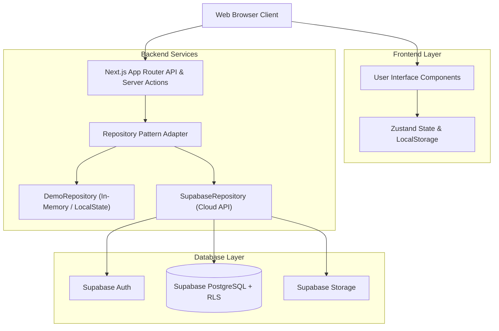
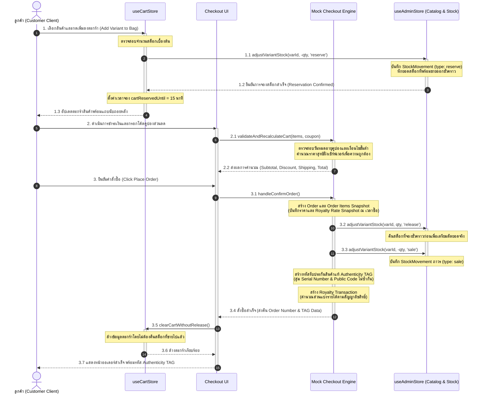
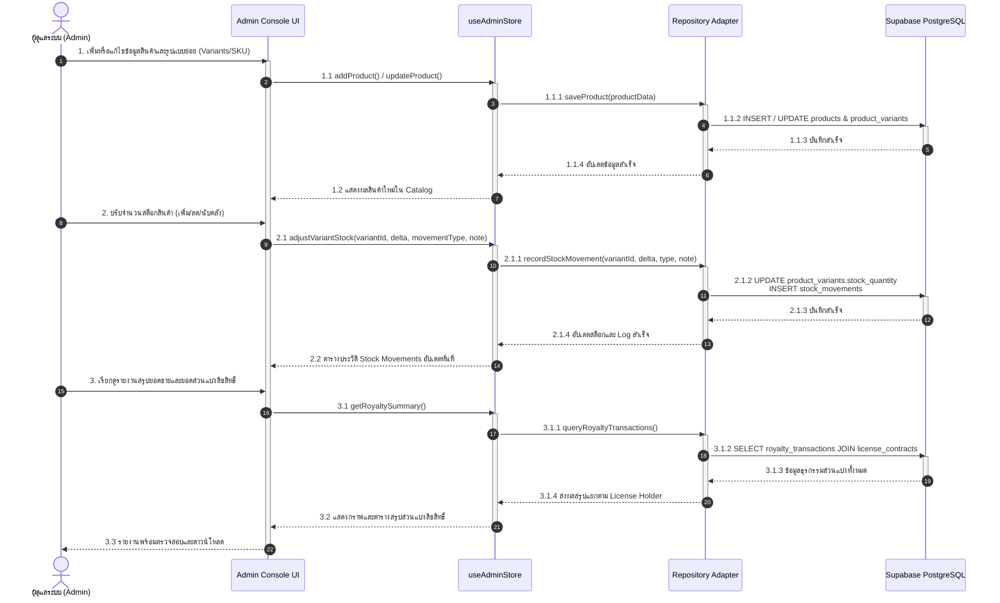

# AllThingsMerch – Licensed Merchandise E-Commerce Platform

ระบบร้านค้าออนไลน์จำหน่ายสินค้าลิขสิทธิ์แท้ พร้อมระบบออกรหัสรับประกันสินค้าแท้ (Authenticity TAG) และบริหารส่วนแบ่งลิขสิทธิ์ (Royalty Share)

---

# สารบัญ

## Planning
- [1. ข้อมูลกลุ่ม (Group Information)](#1-ข้อมูลกลุ่ม-group-information)
- [2. หลักการและเหตุผล (Rationale)](#2-หลักการและเหตุผล-rationale)
- [3. วัตถุประสงค์ของโครงการ (Objectives)](#3-วัตถุประสงค์ของโครงการ-objectives)
- [4. ผลลัพธ์ที่คาดว่าจะได้รับ (Expected Outcomes)](#4-ผลลัพธ์ที่คาดว่าจะได้รับ-expected-outcomes)
- [5. แนวทางการพัฒนาระบบ (SDLC)](#5-แนวทางการพัฒนาระบบ-sdlc)
- [6. เครื่องมือและเทคโนโลยีที่ใช้ (Tools & Technologies)](#6-เครื่องมือและเทคโนโลยีที่ใช้-tools--technologies)
- [7. แผนการดำเนินงาน (Work Plan)](#7-แผนการดำเนินงาน-work-plan)

## Analysis
- [8. ขอบเขตของระบบ (System Scope)](#8-ขอบเขตของระบบ-system-scope)
- [9. Persona Design – AllThingsMerch](#9-persona-design--allthingsmerch)
- [10. Use Case Diagram](#10-use-case-diagram)

## Design
- [11. System Architecture](#11-system-architecture)
- [12. Wireframe / Prototype](#12-wireframe--prototype)
- [13. Class Diagram](#13-class-diagram)
- [14. Sequence Diagram](#14-sequence-diagram)
- [15. Data Schema (JSON)](#15-data-schema-json)

## Testing
- [16. แนวทางการทดสอบระบบ (Testing Approach)](#16-แนวทางการทดสอบระบบ-testing-approach)
- [17. Test Case – AllThingsMerch](#17-test-case--allthingsmerch)

---

# Planning

## 1. ข้อมูลกลุ่ม (Group Information)

- ชื่อกลุ่ม: AllThingsMerch
- จำนวนสมาชิก: 5 คน
- รายชื่อสมาชิก:

| รหัสนักศึกษา | ชื่อและนามสกุล | หน้าที่ |
| :--- | :--- | :--- |
| 67160165 | นายธนกร หีบเงิน | ผู้พัฒนา Frontend/Backend |
| 67160449 | นายณฐมน โชติกุล | ผู้พัฒนา Frontend/Backend |
| 67132694 | นายนิรินทร์ เทพวิสุทธิพันธุ์ | ผู้พัฒนา Frontend/Backend |
| 67167855 | นายกฤตณัฐ อิ้วสมจิตร | ผู้พัฒนา Frontend และ Tester |
| 67185699 | นางสาว กนกกร ทะกอง | ผู้พัฒนา Frontend และ Tester |

---

## 2. หลักการและเหตุผล (Rationale)

ในปัจจุบันตลาดสินค้าลิขสิทธิ์แท้ (Licensed Merchandise) โดยเฉพาะกลุ่มสินค้าจากแฟนคลับและสินค้าของสะสม เช่น ทีมแข่งรถ Formula 1 ศิลปินระดับโลก และสโมสรฟุตบอลชั้นนำ มีการเติบโตและความต้องการสูงมาก แต่ผู้บริโภคยังคงประสบปัญหาความไม่มั่นใจว่าสินค้าที่สั่งซื้อเป็นสินค้าลิขสิทธิ์แท้หรือไม่ หรือมีความเสี่ยงต่อการพบสินค้าลอกเลียนแบบในท้องตลาด นอกจากนี้ ในมุมมองของการบริหารจัดการธุรกิจ การจัดจำหน่ายสินค้าลิขสิทธิ์จากหลายแบรนด์และหลายเจ้าของสิทธิ์ (License Holders) มีความซับซ้อนอย่างยิ่ง โดยเฉพาะการบันทึกสัญญาและการคำนวณอัตราส่วนแบ่งรายได้ (Royalty Share) ที่ต้องมีความถูกต้อง โปร่งใส และสามารถตรวจสอบย้อนหลังได้อย่างแม่นยำ

การพัฒนาระบบร้านค้าออนไลน์ **AllThingsMerch** จึงถูกสร้างขึ้นเพื่อแก้ไขปัญหาดังกล่าวอย่างครบวงจร โดยเน้นคุณค่าหลัก 3 ประการ ได้แก่:
1. **ความน่าเชื่อถือสูงสุด (Guaranteed Authenticity)** ด้วยการออกรหัสรับประกันสินค้าแท้ (Authenticity TAG) ที่มีรหัสสาธารณะ (Public Code) และหมายเลขเครื่อง (Serial Number) ไม่ซ้ำกันให้แก่สินค้าทุกชิ้นที่ซื้อสำเร็จจากทางร้าน เพื่อให้ลูกค้าสามารถตรวจสอบความแท้ผ่านระบบ Verify TAG ได้ทุกเวลา
2. **ระบบการสั่งซื้อและจองสินค้าที่มีประสิทธิภาพ (Smart Ordering & Reservation)** รองรับทั้งสินค้าพร้อมส่ง สินค้า Limited Edition และสินค้าสั่งซื้อล่วงหน้า (Pre-Order) พร้อมกลไกล็อกสต็อกชั่วคราว (Temporary Stock Reservation) 15 นาที เพื่อป้องกันปัญหาสั่งซื้อชนกันหรือสต็อกขาดในช่วงเปิดจองสินค้ายอดนิยม
3. **การบริหารสิทธิ์และส่วนแบ่งอัตโนมัติ (Automated Royalty Management)** ระบบหลังบ้านที่บันทึกสัญญาลิขสิทธิ์และคำนวณส่วนแบ่งรายได้ให้ผู้ถือครองสิทธิ์ทันทีเมื่อเกิดคำสั่งซื้อ โดยใช้กลไก Snapshot อัตราส่วนแบ่ง ณ เวลาที่ซื้อ เพื่อไม่ให้กระทบต่อประวัติธุรกรรมหากมีการเปลี่ยนแปลงสัญญาในอนาคต

---

## 3. วัตถุประสงค์ของโครงการ (Objectives)

1. พัฒนาระบบร้านค้าออนไลน์ที่ทันสมัยสำหรับจัดจำหน่ายสินค้าลิขสิทธิ์แท้ (Licensed Merchandise) ให้ลูกค้าสามารถค้นหาสินค้า กรองตามแบรนด์หรือประเภทลิขสิทธิ์ และเลือกซื้อสินค้าได้อย่างสะดวก รวดเร็ว และมั่นใจ
2. รองรับรูปแบบการขายที่หลากหลาย ทั้งสินค้าปกติและสินค้าสั่งซื้อล่วงหน้า (Pre-Order) สำหรับสินค้ารุ่นพิเศษ (Limited Edition) หรือสินค้าจำนวนจำกัด พร้อมระบบล็อกสต็อกชั่วคราว (Temporary Stock Lock) 15 นาทีระหว่างรอชำระเงิน
3. สร้างระบบออกรหัสรับประกันสินค้าแท้ (Authenticity TAG) ให้กับรายการสินค้าแต่ละชิ้นแบบอัตโนมัติทันทีที่คำสั่งซื้อสำเร็จ พร้อมหน้าตรวจสอบรหัสยืนยันสินค้าแท้ (Verify TAG System) ที่สาธารณะและลูกค้าสามารถตรวจสอบได้จริง
4. จัดทำระบบหลังบ้านสำหรับผู้ดูแลระบบ (Admin) ในการบริหารจัดการสินค้า รูปแบบสินค้าย่อย (Variants/SKU) สต็อกสินค้าและประวัติการเคลื่อนย้ายสต็อก (Stock Movements) คูปองส่วนลด สัญญาลิขสิทธิ์ และระบบคำนวณส่วนแบ่งลิขสิทธิ์ (Royalty Transactions) พร้อมรายงานสถิติที่ครบถ้วน

---

## 4. ผลลัพธ์ที่คาดว่าจะได้รับ (Expected Outcomes)

1. ลูกค้าได้รับประสบการณ์การช้อปปิ้งออนไลน์ที่น่าเชื่อถือและมั่นใจสูงสุด โดยสามารถตรวจสอบรหัสยืนยันสินค้าลิขสิทธิ์แท้ (Authenticity TAG) ของสินค้าทุกชิ้นที่สั่งซื้อได้ตลอดเวลา
2. ระบบสามารถรองรับการสั่งซื้อสินค้าและการสั่งซื้อล่วงหน้า (Pre-Order) ได้อย่างมีประสิทธิภาพ ช่วยลดปัญหาการจองสินค้าซ้อนและรักษาสมดุลของสต็อกสินค้าด้วยระบบจองชั่วคราว 15 นาที
3. ผู้ดูแลระบบสามารถบริหารจัดการ catalog สินค้าที่มีความซับซ้อน (เช่น สี ไซซ์ SKU) และติดตามประวัติการเพิ่ม-ลดสต็อก (Stock Movements) ทุกรายการได้อย่างโปร่งใส เป็นระบบ และตรวจสอบย้อนหลังได้
4. ระบบสามารถคำนวณส่วนแบ่งรายได้ค่าลิขสิทธิ์ให้แก่คู่ค้าและเจ้าของลิขสิทธิ์ (License Holders) ได้อย่างถูกต้องอัตโนมัติตาม Snapshot ณ วันที่สั่งซื้อ พร้อมออกรายงานสรุปยอดขายและยอดส่วนแบ่งได้อย่างแม่นยำ
5. โครงสร้างระบบมีความมั่นคง ปลอดภัย รองรับการขยายตัวในอนาคตด้วยสถาปัตยกรรมแบบ Dual-Mode Repository และฐานข้อมูล Supabase PostgreSQL ที่ใช้ Row Level Security (RLS) ในการปกป้องข้อมูลระดับแถว

---

## 5. แนวทางการพัฒนาระบบ (SDLC)

### Planning
- กำหนดขอบเขตโครงการ วัตถุประสงค์ กลุ่มเป้าหมาย และการแบ่งบทบาทหน้าที่ของสมาชิกในทีม
- ศึกษากระบวนการทางธุรกิจของร้านค้าสินค้าลิขสิทธิ์ ความต้องการด้านความโปร่งใสของอัตราส่วนแบ่ง และความต้องการของลูกค้าในการตรวจสอบสินค้าแท้
- เลือกเทคโนโลยีหลักคือ Next.js App Router, Zustand, Supabase (PostgreSQL + RLS) และเครื่องมือในการทำงานร่วมกัน (Git, GitHub, Figma)

### Analysis
- วิเคราะห์ปัญหาและความต้องการของผู้ใช้งาน 3 กลุ่มหลัก ได้แก่ ลูกค้า (Customer), ผู้ดูแลระบบ (Admin) และผู้ถือครองลิขสิทธิ์ (License Holder)
- ออกแบบ Use Case Diagram, Persona และความต้องการเชิงฟังก์ชัน/คุณลักษณะ (Functional & Non-Functional Requirements) เพื่อวางกรอบการทำงานให้ชัดเจน

### Design
- ออกแบบสถาปัตยกรรมระบบ (System Architecture) โดยใช้ Repository Pattern ที่รองรับทั้ง Dual-Mode (DemoRepository และ SupabaseRepository) เพื่อให้ทดสอบระบบได้รวดเร็วและเชื่อมต่อ Cloud Database ได้อย่างมีประสิทธิภาพ
- ออกแบบฐานข้อมูล (ERD / Data Schema) ครอบคลุมระบบผู้ใช้งาน สินค้า รูปแบบย่อย สต็อก คำสั่งซื้อ TAG รับประกันสินค้าแท้ และธุรกรรมส่วนแบ่งลิขสิทธิ์
- ออกแบบ Wireframe และ UI/UX ผ่าน Figma โดยเน้นดีไซน์ที่ทันสมัย พรีเมียม และใช้งานง่าย (Modern Premium E-Commerce) พร้อม Class Diagram และ Sequence Diagram

### Development
- พัฒนา Frontend และ Backend ควบคู่กันบนโครงสร้าง Next.js App Router โดยใช้ TypeScript ทั้งระบบ
- พัฒนา State Management ด้วย Zustand (`useAuthStore`, `useCartStore`, `useAdminStore`) เชื่อมต่อเข้ากับ Server Actions / API Handlers และ Repository Adapter
- จัดทำระบบจำลองการชำระเงิน (Mock Checkout Engine) ระบบจองสต็อกชั่วคราว ระบบออกรหัส Authenticity TAG และระบบคำนวณส่วนแบ่ง Royalty Transaction อัตโนมัติ

### Testing
- ดำเนินการทดสอบระบบแบบครบวงจร ทั้ง User Acceptance Testing (UAT) โดยใช้ Manual Testing ตาม Test Cases ที่ออกแบบไว้ และ Automated Testing ด้วย Vitest/Playwright
- ตรวจสอบความถูกต้องของการคำนวณราคาสินค้า คูปองส่วนลด ค่าจัดส่ง การคำนวณส่วนแบ่งลิขสิทธิ์ และการทำงานของระบบรักษาความปลอดภัย Row Level Security (RLS)

### Deployment
- นำระบบขึ้นสู่สภาพแวดล้อมจริง (Production Deployment) ผ่านผู้ให้บริการ Cloud Platforms:
  - **Frontend / Server Actions API**: Deploy ผ่าน Vercel โหลดเร็วและรองรับ Serverless Functions
  - **Database & Authentication**: ใช้บริการ Supabase (Cloud PostgreSQL + Supabase Auth) พร้อมเปิดใช้งาน Connection Pooler และ RLS Policies
  - **Version Control & CI/CD**: ใช้ GitHub ร่วมกับ GitHub Actions ในการตรวจสอบรูปแบบโค้ด (Linting/Formatting) และรัน Automated Tests ก่อนทำการ Merge/Deploy

### Maintenance
- ติดตามตรวจสอบการทำงานของระบบผ่าน Logs และผลตอบรับของผู้ใช้งาน
- วางแผนปรับปรุงและอัปเดตฟีเจอร์ใหม่ การดูแลความปลอดภัย ตลอดจนการบำรุงรักษาฐานข้อมูลและการสำรองข้อมูลอย่างสม่ำเสมอ

---

## 6. เครื่องมือและเทคโนโลยีที่ใช้ (Tools & Technologies)

| หมวดหมู่ | เทคโนโลยี | หมายเหตุ |
| :--- | :--- | :--- |
| Frontend | Next.js App Router (React + TypeScript) | UI ทั้งฝั่งหน้าร้านออนไลน์ (Storefront Customer) และระบบหลังบ้าน (Admin Console) |
| Styling | Tailwind CSS + Lucide Icons | การจัดการดีไซน์ระบบแบบ Responsive และมีความพรีเมียมทันสมัย |
| Backend | Next.js API Routes & Server Actions | Dual-Mode Repository Pattern รองรับทั้ง local state และ Supabase API |
| State Management | Zustand + LocalStorage | บริหารจัดการตะกร้าสินค้า (`useCartStore`), เซสชันผู้ใช้ (`useAuthStore`) และข้อมูลหลังบ้าน (`useAdminStore`) |
| Database | PostgreSQL (ผ่าน Supabase) | จัดเก็บข้อมูลระบบทั้งหมด พร้อมเปิดใช้งาน Row Level Security (RLS) และ Supabase Storage |
| Authentication | Supabase Auth + JWT Metadata | จัดการ Login/Register และแยกระดับสิทธิ์ผู้ใช้งาน (Customer, Admin, License Holder) |
| Payment & Fulfillment | Mock Checkout Engine | จำลองระบบคำนวณส่วนลดคูปอง ค่าจัดส่ง ตัดสต็อก ออก TAG รับประกันสินค้าแท้ และคำนวณส่วนแบ่งลิขสิทธิ์อัตโนมัติ |
| Design Tools | Figma, Draw.io, Mermaid | ออกแบบ UI/UX, Wireframe, ERD และแผนภาพ Diagram สถาปัตยกรรมระบบทั้งหมด |
| Version Control | Git, GitHub | บริหารจัดการ Source Code ด้วย Branching Strategy (main, develop, feature) |
| CI/CD & Testing | GitHub Actions, Vitest, Playwright | ตรวจสอบคุณภาพโค้ด Syntax Style และ Automated Tests ก่อนทำการ Deploy |
| Deployment | Vercel (Web App), Supabase (Cloud DB) | Continuous Deployment อัตโนมัติจาก GitHub |
| Collaboration | Discord | ช่องทางสื่อสาร ติดตามความคืบหน้า และประสานงานภายในทีมพัฒนา |

---

## 7. แผนการดำเนินงาน (Work Plan)

โครงการ AllThingsMerch มีการแบ่งช่วงระยะเวลาการดำเนินงานและการส่งมอบงานออกเป็น 6 ระยะหลัก ดังนี้:

- **Phase 1: System Analysis & Design**
  - วิเคราะห์ความต้องการระบบ รวบรวมข้อมูลสินค้าลิขสิทธิ์ และกำหนดขอบเขตฟังก์ชัน
  - ออกแบบหน้าจอหลัก (Wireframe/Prototype) โครงสร้างฐานข้อมูล (ERD) และ Flow การทำงานของระบบทั้งหมด
- **Phase 2: Core Foundation & Auth Development**
  - ตั้งค่าโครงสร้างโปรเจกต์ Next.js, Tailwind CSS และ Repository Pattern
  - พัฒนาระบบบัญชีผู้ใช้ สมัครสมาชิก เข้าสู่ระบบ (Supabase Auth) และระบบจัดการสินค้าหลัก/รูปแบบย่อย (Variants/SKU)
- **Phase 3: Shopping & Checkout Engine**
  - พัฒนาระบบค้นหา กรองสินค้า และหน้ารายละเอียดสินค้า
  - พัฒนาระบบตะกร้าสินค้า ระบบจองสต็อกชั่วคราว 15 นาที (Stock Reservation) ระบบคูปองส่วนลด และระบบสั่งซื้อล่วงหน้า (Pre-Order)
- **Phase 4: Authenticity TAG System**
  - พัฒนากลไกการสร้างและออกรหัสรับประกันสินค้าแท้ (Authenticity TAG) เมื่อคำสั่งซื้อสำเร็จ (Unique Public Code & Serial Number)
  - พัฒนาหน้าตรวจสอบรหัสรับประกันสินค้าแท้ (Verify TAG Page) สำหรับลูกค้าและบุคคลทั่วไป
- **Phase 5: Licensing & Royalty Management**
  - พัฒนาระบบจัดการผู้ถือครองลิขสิทธิ์ (License Holders) และสัญญาลิขสิทธิ์ (License Contracts) ใน Admin Console
  - พัฒนากลไกคำนวณส่วนแบ่งลิขสิทธิ์ (Royalty Transactions) อัตโนมัติ และรายงานสรุปยอดขาย/ยอดส่วนแบ่งหลังบ้าน
- **Phase 6: Testing, CI/CD & Presentation**
  - ทำการทดสอบระบบรวม (UAT + Manual Testing + Automated Testing) แก้ไขข้อผิดพลาด (Bug Fixes)
  - ตั้งค่า CI/CD บน GitHub Actions, Deploy ระบบจริงบน Vercel + Supabase และเตรียมเอกสารพร้อมนำเสนอโครงการ

---

# Analysis

## 8. ขอบเขตของระบบ (System Scope)

### 8.1 ลูกค้า (Customer)
- สมัครสมาชิก
- เข้าสู่ระบบ
- ออกจากระบบ
- แก้ไขข้อมูลส่วนตัว
- จัดการที่อยู่ในการจัดส่งสินค้า
- ค้นหาสินค้าด้วยคำสำคัญ
- กรองสินค้าตามประเภทลิขสิทธิ์และแบรนด์
- ดูรายละเอียดสินค้าและสต็อกคงเหลือ
- เพิ่มสินค้าลงตะกร้า
- ปรับจำนวนสินค้าในตะกร้า
- ลบสินค้าออกจากตะกร้า
- สั่งซื้อสินค้าปกติ (Ready-to-ship)
- สั่งซื้อล่วงหน้า (Pre-Order)
- ใช้คูปองส่วนลด
- ตรวจสอบรหัสรับประกันสินค้าแท้ (Verify TAG)
- ติดตามสถานะคำสั่งซื้อ
- ดูประวัติคำสั่งซื้อ
- เขียนรีวิวสินค้า
- ให้คะแนนสินค้า

### 8.2 ผู้ดูแลระบบ (Admin)
- เพิ่มข้อมูลสินค้าใหม่
- แก้ไขข้อมูลสินค้า
- ลบข้อมูลสินค้า
- เปลี่ยนสถานะการมองเห็นสินค้า
- กำหนดสถานะสินค้ารุ่นพิเศษ (Limited Edition) และสินค้าสั่งซื้อล่วงหน้า (Pre-Order)
- จัดการรูปแบบสินค้าย่อย (Variants / SKU) และราคา
- ปรับเพิ่มและลดจำนวนสต็อกสินค้า
- ตรวจสอบประวัติการเคลื่อนย้ายสต็อก (Stock Movements)
- จัดการข้อมูลผู้ถือครองลิขสิทธิ์ (License Holders)
- จัดการข้อมูลสัญญาลิขสิทธิ์ (License Contracts)
- กำหนดอัตราส่วนแบ่งรายได้ลิขสิทธิ์ (Royalty Rate)
- ตรวจสอบรายการคำสั่งซื้อทั้งหมด
- อัปเดตสถานะคำสั่งซื้อและการจัดส่ง
- สร้างและแก้ไขคูปองส่วนลด
- กำหนดโควต้าและวันหมดอายุคูปองส่วนลด
- ตรวจสอบรายงานสรุปยอดขาย (Sales Reports)
- ตรวจสอบรายงานส่วนแบ่งลิขสิทธิ์ (Royalty Reports)
- ซ่อนและแสดงความคิดเห็นรีวิวในระบบ

### 8.3 ผู้ถือครองลิขสิทธิ์ (License Holder)
- เข้าสู่ระบบในบทบาทคู่ค้าผู้ถือครองลิขสิทธิ์ (Partner Dashboard)
- ดูรายงานยอดขายสินค้าภายใต้ลิขสิทธิ์ของตนเอง (Read-Only)
- ตรวจสอบยอดเงินส่วนแบ่งรายได้ตามสัญญา (Royalty Transactions)

---

## 9. Persona Design – AllThingsMerch

### 9.1 Customer (ลูกค้าผู้ชื่นชอบสินค้าแฟนคลับและของสะสม)
- **Profile**: แฟนคลับ นักสะสมสินค้า Limited Edition และผู้บริโภคทั่วไปที่มีความชื่นชอบในทีม F1 ศิลปิน หรือสโมสรกีฬา
- **Goals**:
  - ได้รับสินค้าลิขสิทธิ์แท้ 100% พร้อมหลักฐานยืนยันที่สามารถตรวจสอบได้จริง
  - สามารถสั่งซื้อสินค้า Limited Edition หรือสินค้า Pre-Order ได้ทันเวลาโดยไม่โดนแย่งหรือระบบล่ม
  - ได้รับความสะดวกสบายในการค้นหาสินค้า การใช้คูปอง และการติดตามสถานะคำสั่งซื้อ
- **Pain Points**:
  - เคยเจอหรือกังวลว่าจะได้รับสินค้าปลอมลอกเลียนแบบที่มีการแอบอ้างในตลาด
  - เสียความรู้สึกเมื่อกดเพิ่มสินค้าลงตะกร้าแล้ว แต่พอถึงขั้นตอนชำระเงินสต็อกกลับหมด (จึงต้องการระบบล็อกสต็อกชั่วคราว)
  - ไม่ทราบข้อมูลที่แน่ชัดว่าสินค้ารุ่น Pre-Order จะจัดส่งเมื่อใด
- **Behaviors**:
  - เข้าเว็บไซต์เพื่อติดตามสินค้าเข้าใหม่หรือสินค้า Limited ของแบรนด์ที่ชื่นชอบ
  - ใช้ฟังก์ชันค้นหาและตัวกรองตามแบรนด์/ประเภทลิขสิทธิ์อย่างสม่ำเสมอ
  - นำรหัส Authenticity TAG ของสินค้าที่ได้รับไปตรวจสอบในหน้า Verify TAG เพื่อความมั่นใจและใช้เป็นหลักฐานสะสม
  - ชอบอ่านรีวิวและเขียนรีวิวแบ่งปันประสบการณ์หลังจากได้รับสินค้า

### 9.2 Admin (ผู้ดูแลระบบและผู้จัดการร้านค้า)
- **Profile**: เจ้าหน้าที่บริหารจัดการแพลตฟอร์ม ผู้ดูแลคลังสินค้า และผู้จัดการฝ่ายลิขสิทธิ์ของ AllThingsMerch
- **Goals**:
  - จัดการ catalog สินค้าที่มีรูปแบบย่อย (SKU, ไซซ์, สี) และสต็อกสินค้าได้อย่างถูกต้อง ไม่เกิดข้อผิดพลาด
  - ตรวจสอบและอัปเดตสถานะคำสั่งซื้อได้อย่างรวดเร็ว เพื่อให้การจัดส่งเป็นไปอย่างราบรื่น
  - บริหารจัดการข้อมูลสัญญาลิขสิทธิ์และคำนวณส่วนแบ่งรายได้ให้คู่ค้าอย่างถูกต้อง แม่นยำ และโปร่งใส
- **Pain Points**:
  - การบริหารสต็อกสินค้าที่มีหลาย SKU และมีการจอง-ปล่อยสต็อกตลอดเวลามีความซับซ้อนสูง
  - การคำนวณส่วนแบ่งรายได้ลิขสิทธิ์ด้วยตนเองใช้เวลานานและเสี่ยงต่อความผิดพลาดหากราคาสินค้าหรือคูปองมีการเปลี่ยนแปลง
- **Behaviors**:
  - เข้าสู่ Admin Console เป็นประจำทุกวันเพื่อตรวจสอบคำสั่งซื้อใหม่และสถานะสต็อก
  - ปรับสต็อกสินค้าและตรวจสอบ Stock Movement Log เมื่อมีสินค้าล็อตใหม่เข้ามาหรือเมื่อมีการปรับแก้ยอด
  - ตรวจสอบรายงานยอดขายและรายงาน Royalty Transactions ทุกสิ้นเดือนเพื่อสรุปยอดนำจ่ายผู้ถือสิทธิ์

### 9.3 License Holder (คู่ค้าผู้ถือครองลิขสิทธิ์และเจ้าของแบรนด์)
- **Profile**: ตัวแทนจากบริษัทแบรนด์สินค้า ต้นสังกัดศิลปิน ทีมแข่งรถ หรือองค์กรกีฬาที่เป็นคู่ค้าอนุญาตให้ AllThingsMerch ผลิตและจัดจำหน่ายสินค้า
- **Goals**:
  - ตรวจสอบยอดขายของสินค้าภายใต้ลิขสิทธิ์ของตนเองได้อย่างถูกต้องและเป็นปัจจุบัน
  - มั่นใจในความโปร่งใสของการคำนวณส่วนแบ่งรายได้ (Royalty Rate %) ตามสัญญาที่ตกลงไว้
- **Pain Points**:
  - ในระบบทั่วไปมักไม่สามารถตรวจสอบยอดขายจริงได้ ต้องรอรายงานสรุปจากร้านค้าซึ่งอาจมีความล่าช้าหรือไม่โปร่งใส
- **Behaviors**:
  - เข้าสู่ระบบ Partner Dashboard ของ AllThingsMerch เพื่อเรียกดูสถิติยอดขายและยอดส่วนแบ่งลิขสิทธิ์ประจำสัปดาห์หรือประจำเดือน

---

## 10. Use Case Diagram

```mermaid
graph TD
    classDef actor fill:#f9f9f9,stroke:#333,stroke-width:2px;
    classDef usecase fill:#fff,stroke:#333,stroke-width:1.5px;

    %% Actors
    Customer["Customer (ลูกค้า)"]:::actor
    Admin["Admin (ผู้ดูแลระบบ)"]:::actor
    LicenseHolder["License Holder (ผู้ถือลิขสิทธิ์)"]:::actor

    subgraph Boundary [AllThingsMerch System Boundary]
        %% Customer Use Cases
        BrowseCatalog["ค้นหา & กรอง Catalog"]:::usecase
        ManageCart["จัดการตะกร้า (เพิ่ม/ลด/ลบ)"]:::usecase
        StockLock["ล็อกสต็อกชั่วคราว 15 นาที"]:::usecase
        ApplyCoupon["ใช้คูปองส่วนลด"]:::usecase
        Checkout["ชำระเงิน (Mock Checkout)"]:::usecase
        TrackOrder["ติดตามสถานะคำสั่งซื้อ"]:::usecase
        VerifyTag["ตรวจสอบสินค้าแท้ (Verify TAG)"]:::usecase
        WriteReview["รีวิว & ให้คะแนนสินค้า"]:::usecase

        %% Admin Use Cases
        ManageProducts["จัดการสินค้า (CRUD / Variants)"]:::usecase
        AdjustStock["ปรับสต็อก (Draft -> Bulk Commit)"]:::usecase
        ManageContracts["จัดการสัญญาลิขสิทธิ์"]:::usecase
        ManageCoupons["จัดการคูปอง (กำหนดโควต้าสิทธิ์)"]:::usecase
        UpdateOrderStatus["อัปเดตสถานะออเดอร์ (ยกเลิกเพื่อคืนสต็อก)"]:::usecase
        ViewRoyaltyReports["ดูรายงานยอดขาย & ค่าลิขสิทธิ์"]:::usecase
        ManageReviews["ซ่อน/แสดงความคิดเห็นรีวิว"]:::usecase
    end

    %% Customer relationships
    Customer --> BrowseCatalog
    Customer --> ManageCart
    Customer --> ApplyCoupon
    Customer --> Checkout
    Customer --> TrackOrder
    Customer --> VerifyTag
    Customer --> WriteReview

    %% Automated / System Actions triggers
    ManageCart -.->|include| StockLock
    Checkout -.->|include| StockLock

    %% Admin relationships
    Admin --> ManageProducts
    Admin --> AdjustStock
    Admin --> ManageContracts
    Admin --> ManageCoupons
    Admin --> UpdateOrderStatus
    Admin --> ViewRoyaltyReports
    Admin --> ManageReviews

    %% License Holder relationships
    LicenseHolder --> ViewRoyaltyReports
```



### สรุปคำอธิบายความสัมพันธ์ใน Use Case Diagram

| รูปแบบความสัมพันธ์ | รายการยูสเคส | ความหมายและเงื่อนไขการทำงาน |
| :--- | :--- | :--- |
| `<<include>>` | ManageCart → StockLock | เมื่อลูกค้าเพิ่มสินค้าลงตะกร้า ระบบจะทำการล็อกและจองสต็อกชั่วคราว (Reserve Stock) ให้เป็นระยะเวลา 15 นาทีโดยอัตโนมัติเสมอ |
| `<<include>>` | Checkout → StockLock | ในขั้นตอนชำระเงิน ระบบจะตรวจสอบเวลาของ StockLock หากหมดอายุจะต้องทำการตรวจสอบสต็อกและจองใหม่ หรือหากสำเร็จจะปล่อยการจองชั่วคราวเพื่อบันทึกตัดสต็อกจริง |
| `<<include>>` | Checkout → BrowseCatalog / ManageCart | การทำรายการสั่งซื้อจะต้องผ่านขั้นตอนการเลือกสินค้าลงตะกร้าสินค้าก่อนเสมอ |
| `<<include>>` | TrackOrder / WriteReview → Login | ลูกค้าต้องเข้าสู่ระบบก่อนจึงจะสามารถติดตามสถานะคำสั่งซื้อของตนเองหรือเขียนรีวิวสินค้าได้ |
| `<<extend>>` | Pre-Order Flow (ใน Checkout) | หากสินค้านั้นมีสถานะเป็น `isPreorder: true` ระบบจะดำเนินการบันทึกข้อมูลวันที่คาดว่าจะจัดส่ง (`preorderReleaseAt`) เพิ่มเติมในออเดอร์ |

---

# Design

## 11. System Architecture

ระบบ AllThingsMerch ถูกออกแบบด้วยสถาปัตยกรรมแบบ Full-stack Web Application บนแพลตฟอร์ม Next.js App Router โดยมีการแยกระดับชั้นการทำงานอย่างชัดเจน และรองรับกลไก Dual-Mode Repository Pattern ที่อนุญาตให้ระบบทำงานได้ทั้งแบบ In-Memory / LocalStorage สำหรับการสาธิต (Demo Mode) และการเชื่อมต่อฐานข้อมูลจริงผ่าน Supabase Cloud API



### คำอธิบายองค์ประกอบสถาปัตยกรรมหลัก:
1. **Frontend Layer**: พัฒนาด้วย React Server Components และ Client Components บน Next.js โดยใช้ Tailwind CSS ในการจัดสไตล์ และใช้ **Zustand** เป็น Global State Manager แยกตามหน้าที่ (`useAuthStore`, `useCartStore`, `useAdminStore`)
2. **Backend & Application Layer**: ประมวลผลตรรกะทางธุรกิจผ่าน Next.js Server Actions และ API Routes โดยมี **Repository Pattern Adapter** เป็นตัวกลาง ทำให้ Business Logic ไม่ยึดติดกับฐานข้อมูลเฉพาะเจาะจง
3. **Database Layer**: ใช้บริการ **Supabase PostgreSQL** ที่มีฟีเจอร์ความปลอดภัยสูงสุดอย่าง **Row Level Security (RLS)** ในการปกป้องข้อมูลระดับแถวตามบทบาท (Role) ของผู้ใช้งานใน JWT Metadata พร้อม Supabase Auth และ Storage

---

## 12. Wireframe / Prototype

การออกแบบหน้าจอผู้ใช้งาน (UI/UX Design) ของ AllThingsMerch มุ่งเน้นไปที่ความพรีเมียม สวยงาม ทันสมัย และตอบสนองการใช้งานในทุกอุปกรณ์ (Responsive Design) โดยแบ่งโครงสร้างหน้าจอออกเป็น 3 ส่วนสำคัญ:

1. **Storefront (สำหรับลูกค้าทั่วไป)**
   - **Homepage & Hero Banner**: แสดงโปรโมชั่น สินค้าเด่น และสินค้ารุ่น Limited Edition
   - **Catalog & Filter Sidebar**: ตัวกรองสินค้าตามแบรนด์ (F1, ศิลปิน, สโมสร) หมวดหมู่ ช่วงราคา และสถานะพร้อมส่ง/Pre-order
   - **Product Detail Page (PDP)**: แสดงรูปภาพสินค้า ตัวเลือกสี/ไซซ์ ราคา สต็อกคงเหลือ และข้อมูลป้ายรับประกันสินค้าลิขสิทธิ์แท้
   - **Shopping Cart & Checkout Modal**: หน้าต่างตะกร้าสินค้าพร้อมแถบนับถอยหลังการจองสต็อก 15 นาที ช่องใส่คูปอง และหน้าสรุปออเดอร์
   - **Verify TAG Page**: หน้าตรวจสอบรหัส Authenticity TAG โดยลูกค้าสามารถกรอกรหัสสาธารณะเพื่อยืนยันข้อมูลสินค้าและวันที่ออกรหัส

2. **Admin Console (สำหรับผู้ดูแลระบบ)**
   - **Dashboard Summary**: แสดงกราฟและตัวเลขสถิติจำนวนออเดอร์ ยอดขายรวม ยอดส่วนแบ่งลิขสิทธิ์ และรายการสั่งซื้อล่าสุด
   - **Catalog Management**: ตารางจัดการสินค้า พร้อม Modal เพิ่ม/แก้ไข Variant SKU ราคา และสต็อก
   - **Inventory & Stock Movements Log**: ตารางตรวจสอบประวัติการย้ายสต็อกทุกรายการ (Reserve, Release, Sale, Return)
   - **Contract & Royalty Manager**: หน้าจัดการผู้ถือลิขสิทธิ์และสัญญา พร้อมตารางแสดงรายงานยอด Royalty Transactions ที่คำนวณอัตโนมัติ


> **ลิงก์ต้นแบบและดีไซน์อ้างอิง**: สามารถดูรายละเอียดการออกแบบและโครงสร้างหน้าจอทั้งหมดของโปรเจกต์ได้ในเอกสาร SADS (`ALLTHINGSMERCH_CODEX_SPEC.md`) และต้นแบบ UI บน Figma ของกลุ่ม AllThingsMerch

---

## 13. Class Diagram

แผนภาพแสดงความสัมพันธ์ของ Component หลัก, Zustand Store และ Domain Data Models ต่างๆ ภายในระบบ AllThingsMerch:

```mermaid
classDiagram
    %% ─── Authentication Layer ───
    class useAuthStore {
        +UserProfile user
        +SavedAddress[] addresses
        +login(string id, string email, string fullName, string role) void
        +logout() void
        +updateProfile(string fullName, string phone) void
        +loginAsDemoCollector() void
        +loginAsDemoAdmin() void
        +addAddress(string label, string fullName, string email, string phone, string street, string city, string postalCode, boolean isDefault) SavedAddress
        +updateAddress(string id, string label, string street, boolean isDefault) void
        +deleteAddress(string id) void
        +setDefaultAddress(string id) void
    }

    class UserProfile {
        +string id
        +string email
        +string fullName
        +string phone
        +UserRole role
        +string createdAt
    }

    class UserRole {
        <<enumeration>>
        customer
        admin
        license_holder
    }

    class SavedAddress {
        +string id
        +string label
        +string fullName
        +string email
        +string phone
        +string street
        +string city
        +string postalCode
        +boolean isDefault
    }

    useAuthStore "1" o-- "0..1" UserProfile : manages
    useAuthStore "1" o-- "*" SavedAddress : manages
    UserProfile "1" --> "1" UserRole : has

    note for useAuthStore "Role guard อยู่ที่ admin/layout.tsx\nif user.role !== admin → redirect"

    %% ─── Customer-Accessible Layer ───
    class useCartStore {
        <<customer access>>
        +CartItem[] items
        +string cartReservedUntil
        +Coupon appliedCoupon
        +addItem(string variantId, string productId, number quantity) void
        +updateQuantity(string variantId, number quantity) void
        +removeItem(string variantId) void
        +clearCart() void
        +clearCartWithoutRelease() void
        +releaseExpiredReservation() void
        +applyCoupon(string code, number discountValue, string discountType) void
        +removeCoupon() void
        +getTotalCount() number
        +getSubtotal() number
        +getShippingFee() number
        +getDiscountAmount() number
        +getTotalAmount() number
    }

    class CartItem {
        +string id
        +string productId
        +string variantId
        +string productName
        +string productSlug
        +string sku
        +string size
        +string color
        +number unitPrice
        +number quantity
        +string imageUrl
        +string brandName
        +boolean isLimited
        +boolean isPreorder
        +string preorderReleaseAt
        +string reservedUntil
    }

    class Coupon {
        +string id
        +string code
        +string description
        +string discountType
        +number discountValue
        +number minOrderValue
        +number maxGlobalUses
        +number currentGlobalUses
        +number maxUsesPerUser
        +boolean isActive
        +string expiresAt
        +string createdAt
    }

    %% ─── Admin-Accessible Layer ───
    class useAdminStore {
        <<admin access>>
        +Product[] products
        +Order[] orders
        +LicenseContract[] contracts
        +StockMovement[] stockMovements
        +syncOrdersFromStorage() void
        +addProduct(string name, string slug, string description, string brandId, string categoryId, number price, string sku, number stockQuantity, string featuredImage, boolean isLimited) Product
        +toggleProductStatus(string productId) void
        +adjustVariantStock(string variantId, number deltaAmount, string movementType) void
        +updateOrderStatus(string orderNumber, string status) void
        +addContract(string licenseHolderId, string holderName, string contractReference, number royaltyRate, string startsAt, string expiresAt) LicenseContract
    }

    %% ─── Shared Domain Models ───
    class Product {
        +string id
        +string name
        +string slug
        +string description
        +boolean isLimited
        +boolean isPreorder
        +string preorderReleaseAt
        +string brandId
        +string categoryId
        +string licenseContractId
        +string status
        +string createdAt
        +string updatedAt
        +ProductVariant[] variants
        +ProductImage[] images
        +string featuredImage
        +number minPrice
        +number maxPrice
    }

    class ProductVariant {
        +string id
        +string productId
        +string sku
        +string size
        +string color
        +number price
        +number compareAtPrice
        +number stockQuantity
        +number lowStockThreshold
        +boolean isActive
    }

    class Order {
        +string id
        +string orderNumber
        +string status
        +OrderItem[] items
        +number subtotal
        +number shippingFee
        +number discountAmount
        +string couponCode
        +number totalAmount
        +ShippingAddress shippingAddress
        +string paymentMethod
        +boolean isDemoOrder
        +string createdAt
    }

    class OrderItem {
        +string id
        +string productId
        +string variantId
        +string productName
        +string sku
        +string size
        +number unitPrice
        +number quantity
        +number totalPrice
        +string authenticityTagCode
        +string serialNumber
        +number royaltyRateSnapshot
        +string licenseContractId
        +boolean isPreorder
    }

    class StockMovement {
        +string id
        +string productVariantId
        +StockMovementType movementType
        +number quantity
        +string referenceType
        +string referenceId
        +string note
        +string createdAt
    }

    class StockMovementType {
        <<enumeration>>
        receive
        reserve
        release
        sale
        return
        adjustment
    }

    class AuthenticityTagRecord {
        +string tagCode
        +string serialNumber
        +string productId
        +string productName
        +string brandName
        +string sku
        +string size
        +string status
        +string issuedAt
        +string orderNumber
    }

    class LicenseContract {
        +string id
        +string licenseHolderId
        +string holderName
        +string contractReference
        +number royaltyRate
        +string startsAt
        +string expiresAt
        +string status
    }

    %% ─── Role-Based Access (ใครเข้าถึงอะไร) ───
    UserProfile ..> useCartStore : customer accesses
    UserProfile ..> useAdminStore : admin accesses
    UserProfile ..> LicenseContract : license_holder views

    %% ─── Store → Domain Relationships ───
    useCartStore "1" o-- "*" CartItem : manages
    useCartStore "1" --> "0..1" Coupon : applies
    useAdminStore "1" o-- "*" Product : manages
    useAdminStore "1" o-- "*" Order : manages
    useAdminStore "1" o-- "*" StockMovement : tracks
    useAdminStore "1" o-- "*" LicenseContract : manages

    %% ─── Domain Composition ───
    UserProfile "1" --> "*" Order : places
    Product "1" *-- "*" ProductVariant : contains
    Order "1" *-- "*" OrderItem : contains
    CartItem "*" --> "1" ProductVariant : references
    OrderItem "*" --> "1" ProductVariant : references
    ProductVariant "1" --o "*" StockMovement : logs
    OrderItem "1" --> "0..1" AuthenticityTagRecord : has
```



---

## 14. Sequence Diagram

### 14.1 ขั้นตอนการสั่งซื้อสินค้า, ล็อกสต็อกชั่วคราว 15 นาที, ออก Authenticity TAG และคำนวณ Royalty (Customer Checkout Flow)



### 14.2 ขั้นตอนผู้ดูแลระบบจัดการสินค้า, ปรับสต็อกสินค้า และตรวจสอบรายงานส่วนแบ่งลิขสิทธิ์ (Admin Management Flow)



---

## 15. Data Schema (JSON)

> อ้างอิงโครงสร้างจาก Class Diagram และ Entity Relationship Diagram แปลงเป็นสคีมาสำหรับฐานข้อมูล PostgreSQL (Supabase + Row Level Security) ของโปรเจกต์ AllThingsMerch
> แต่ละตารางระบุข้อมูล `fields` (ชื่อ, ชนิดข้อมูล, constraint, คำอธิบาย) และ `relations` (ความสัมพันธ์กับตารางอื่น) พร้อม Note สำคัญสำหรับการทำงานของระบบ

### 15.0 Enum Types

```json
{
  "enums": {
    "user_role": ["customer", "admin", "license_holder"],
    "license_holder_status": ["active", "inactive"],
    "license_contract_status": ["draft", "active", "expired", "terminated"],
    "product_status": ["draft", "active", "archived"],
    "discount_type": ["fixed", "percentage"],
    "order_status": ["pending_payment", "paid", "processing", "shipped", "delivered", "cancelled"],
    "payment_status": ["pending", "paid", "failed", "refunded"],
    "authenticity_tag_status": ["issued", "activated", "revoked"],
    "royalty_transaction_status": ["pending", "confirmed", "reversed", "paid"],
    "stock_movement_type": ["receive", "reserve", "release", "sale", "return", "adjustment"],
    "review_status": ["pending", "published", "hidden"]
  }
}
```

---

### 15.1 users

```json
{
  "table": "users",
  "description": "ผู้ใช้งานระบบทั้งหมด แยกบทบาทและสิทธิ์การเข้าถึงด้วย role",
  "fields": {
    "id": { "type": "uuid", "constraints": ["PRIMARY KEY", "DEFAULT gen_random_uuid()"] },
    "email": { "type": "varchar(255)", "constraints": ["UNIQUE", "NOT NULL"] },
    "password_hash": { "type": "text", "constraints": ["NOT NULL"] },
    "full_name": { "type": "varchar(255)", "constraints": ["NOT NULL"] },
    "phone": { "type": "varchar(20)", "constraints": ["NULLABLE"] },
    "role": { "type": "user_role", "constraints": ["NOT NULL", "DEFAULT 'customer'"] },
    "created_at": { "type": "timestamptz", "constraints": ["NOT NULL", "DEFAULT now()"] },
    "updated_at": { "type": "timestamptz", "constraints": ["NOT NULL", "DEFAULT now()"] }
  },
  "relations": {
    "has_many": ["orders (as user)", "reviews (as user)"],
    "has_one": ["license_holders (if role = license_holder)"]
  }
}
```

---

### 15.2 brands

```json
{
  "table": "brands",
  "description": "แบรนด์สินค้าลิขสิทธิ์ในระบบ (เช่น Formula 1, Artists, Football Clubs)",
  "fields": {
    "id": { "type": "uuid", "constraints": ["PRIMARY KEY", "DEFAULT gen_random_uuid()"] },
    "name": { "type": "varchar(255)", "constraints": ["NOT NULL"] },
    "slug": { "type": "varchar(255)", "constraints": ["UNIQUE", "NOT NULL"] },
    "description": { "type": "text", "constraints": ["NULLABLE"] },
    "logo_url": { "type": "text", "constraints": ["NULLABLE"] },
    "is_active": { "type": "boolean", "constraints": ["NOT NULL", "DEFAULT true"] },
    "created_at": { "type": "timestamptz", "constraints": ["NOT NULL", "DEFAULT now()"] }
  },
  "relations": {
    "has_many": ["products"]
  }
}
```

---

### 15.3 categories

```json
{
  "table": "categories",
  "description": "หมวดหมู่สินค้าในระบบแบบลำดับชั้น (Hierarchical tree)",
  "fields": {
    "id": { "type": "uuid", "constraints": ["PRIMARY KEY", "DEFAULT gen_random_uuid()"] },
    "name": { "type": "varchar(255)", "constraints": ["NOT NULL"] },
    "slug": { "type": "varchar(255)", "constraints": ["UNIQUE", "NOT NULL"] },
    "parent_id": { "type": "uuid", "constraints": ["FOREIGN KEY -> categories.id", "NULLABLE"] },
    "created_at": { "type": "timestamptz", "constraints": ["NOT NULL", "DEFAULT now()"] }
  },
  "relations": {
    "has_many": ["products", "categories (subcategories)"],
    "belongs_to": "categories (parent)"
  }
}
```

---

### 15.4 license_holders

```json
{
  "table": "license_holders",
  "description": "ข้อมูลผู้ถือครองลิขสิทธิ์คู่ค้า ที่ได้รับสิทธิ์ตรวจสอบส่วนแบ่งรายได้",
  "fields": {
    "id": { "type": "uuid", "constraints": ["PRIMARY KEY", "DEFAULT gen_random_uuid()"] },
    "name": { "type": "varchar(255)", "constraints": ["NOT NULL"] },
    "contact_email": { "type": "varchar(255)", "constraints": ["NULLABLE"] },
    "status": { "type": "license_holder_status", "constraints": ["NOT NULL", "DEFAULT 'active'"] },
    "created_at": { "type": "timestamptz", "constraints": ["NOT NULL", "DEFAULT now()"] }
  },
  "relations": {
    "has_many": ["license_contracts"]
  }
}
```

---

### 15.5 license_contracts

```json
{
  "table": "license_contracts",
  "description": "สัญญาลิขสิทธิ์ที่กำหนดอัตราส่วนแบ่งรายได้ (Royalty Rate) และระยะเวลาสัญญา",
  "fields": {
    "id": { "type": "uuid", "constraints": ["PRIMARY KEY", "DEFAULT gen_random_uuid()"] },
    "license_holder_id": { "type": "uuid", "constraints": ["FOREIGN KEY -> license_holders.id", "NOT NULL"] },
    "contract_reference": { "type": "varchar(100)", "constraints": ["UNIQUE", "NOT NULL"] },
    "royalty_rate": { "type": "numeric(6,4)", "constraints": ["NOT NULL", "CHECK (royalty_rate >= 0 AND royalty_rate <= 100)"], "note": "เปอร์เซ็นต์ส่วนแบ่ง เช่น 12.50% เก็บความละเอียดทศนิยม 4 ตำแหน่ง" },
    "starts_at": { "type": "date", "constraints": ["NOT NULL"] },
    "expires_at": { "type": "date", "constraints": ["NOT NULL"] },
    "status": { "type": "license_contract_status", "constraints": ["NOT NULL", "DEFAULT 'active'"] },
    "created_at": { "type": "timestamptz", "constraints": ["NOT NULL", "DEFAULT now()"] }
  },
  "relations": {
    "belongs_to": "license_holders",
    "has_many": ["products", "royalty_transactions"]
  }
}
```

---

### 15.6 products

```json
{
  "table": "products",
  "description": "ข้อมูลสินค้าหลัก เชื่อมโยงกับแบรนด์ หมวดหมู่ และสัญญาลิขสิทธิ์",
  "fields": {
    "id": { "type": "uuid", "constraints": ["PRIMARY KEY", "DEFAULT gen_random_uuid()"] },
    "brand_id": { "type": "uuid", "constraints": ["FOREIGN KEY -> brands.id", "NOT NULL"] },
    "category_id": { "type": "uuid", "constraints": ["FOREIGN KEY -> categories.id", "NOT NULL"] },
    "license_contract_id": { "type": "uuid", "constraints": ["FOREIGN KEY -> license_contracts.id", "NULLABLE"] },
    "name": { "type": "varchar(255)", "constraints": ["NOT NULL"] },
    "slug": { "type": "varchar(255)", "constraints": ["UNIQUE", "NOT NULL"] },
    "description": { "type": "text", "constraints": ["NOT NULL"] },
    "status": { "type": "product_status", "constraints": ["NOT NULL", "DEFAULT 'active'"] },
    "is_preorder": { "type": "boolean", "constraints": ["NOT NULL", "DEFAULT false"] },
    "preorder_release_at": { "type": "timestamptz", "constraints": ["NULLABLE"], "note": "วันที่คาดว่าจะปล่อยสินค้า Pre-Order" },
    "created_at": { "type": "timestamptz", "constraints": ["NOT NULL", "DEFAULT now()"] },
    "updated_at": { "type": "timestamptz", "constraints": ["NOT NULL", "DEFAULT now()"] }
  },
  "relations": {
    "belongs_to": ["brands", "categories", "license_contracts"],
    "has_many": ["product_variants", "product_images", "reviews"]
  }
}
```

---

### 15.7 product_variants

```json
{
  "table": "product_variants",
  "description": "รูปแบบย่อยของสินค้า (Variants) สำหรับจัดการสต็อกและราคาแยกตาม SKU (สี/ไซซ์)",
  "fields": {
    "id": { "type": "uuid", "constraints": ["PRIMARY KEY", "DEFAULT gen_random_uuid()"] },
    "product_id": { "type": "uuid", "constraints": ["FOREIGN KEY -> products.id", "NOT NULL"] },
    "sku": { "type": "varchar(100)", "constraints": ["UNIQUE", "NOT NULL"] },
    "size": { "type": "varchar(50)", "constraints": ["NULLABLE"] },
    "color": { "type": "varchar(50)", "constraints": ["NULLABLE"] },
    "price": { "type": "numeric(12,2)", "constraints": ["NOT NULL", "CHECK (price >= 0)"] },
    "compare_at_price": { "type": "numeric(12,2)", "constraints": ["NULLABLE"] },
    "stock_quantity": { "type": "integer", "constraints": ["NOT NULL", "DEFAULT 0", "CHECK (stock_quantity >= 0)"] },
    "low_stock_threshold": { "type": "integer", "constraints": ["NOT NULL", "DEFAULT 3", "CHECK (low_stock_threshold >= 0)"] },
    "is_active": { "type": "boolean", "constraints": ["NOT NULL", "DEFAULT true"] },
    "created_at": { "type": "timestamptz", "constraints": ["NOT NULL", "DEFAULT now()"] }
  },
  "relations": {
    "belongs_to": "products",
    "has_many": ["order_items", "stock_movements", "authenticity_tags"]
  }
}
```

---

### 15.8 product_images

```json
{
  "table": "product_images",
  "description": "จัดเก็บรูปภาพของสินค้า (หนึ่งสินค้ามีได้หลายรูป จัดเรียงลำดับด้วย sort_order)",
  "fields": {
    "id": { "type": "uuid", "constraints": ["PRIMARY KEY", "DEFAULT gen_random_uuid()"] },
    "product_id": { "type": "uuid", "constraints": ["FOREIGN KEY -> products.id", "NOT NULL"] },
    "storage_path": { "type": "text", "constraints": ["NOT NULL"] },
    "alt_text": { "type": "text", "constraints": ["NOT NULL"] },
    "sort_order": { "type": "integer", "constraints": ["NOT NULL", "DEFAULT 0"] }
  },
  "relations": {
    "belongs_to": "products"
  }
}
```

---

### 15.9 coupons

```json
{
  "table": "coupons",
  "description": "คูปองส่วนลดสำหรับกิจกรรมส่งเสริมการขาย",
  "fields": {
    "id": { "type": "uuid", "constraints": ["PRIMARY KEY", "DEFAULT gen_random_uuid()"] },
    "code": { "type": "varchar(50)", "constraints": ["UNIQUE", "NOT NULL"] },
    "discount_type": { "type": "discount_type", "constraints": ["NOT NULL", "DEFAULT 'fixed'"] },
    "discount_value": { "type": "numeric(12,2)", "constraints": ["NOT NULL", "CHECK (discount_value >= 0)"] },
    "minimum_order_amount": { "type": "numeric(12,2)", "constraints": ["NULLABLE"] },
    "usage_limit": { "type": "integer", "constraints": ["NULLABLE"] },
    "starts_at": { "type": "timestamptz", "constraints": ["NOT NULL"] },
    "expires_at": { "type": "timestamptz", "constraints": ["NOT NULL"] },
    "is_active": { "type": "boolean", "constraints": ["NOT NULL", "DEFAULT true"] },
    "created_at": { "type": "timestamptz", "constraints": ["NOT NULL", "DEFAULT now()"] },
    "updated_at": { "type": "timestamptz", "constraints": ["NOT NULL", "DEFAULT now()"] },
    "usage_count": { "type": "integer", "constraints": ["NOT NULL", "DEFAULT 0", "CHECK (usage_count >= 0)"] },
    "max_uses_per_user": { "type": "integer", "constraints": ["NULLABLE", "CHECK (max_uses_per_user >= 0)"] }
  },
  "relations": {
    "has_many": ["orders"]
  }
}
```

---

### 15.10 orders

```json
{
  "table": "orders",
  "description": "คำสั่งซื้อของลูกค้า บันทึกยอดเงิน ส่วนลด และที่อยู่จัดส่ง",
  "fields": {
    "id": { "type": "uuid", "constraints": ["PRIMARY KEY", "DEFAULT gen_random_uuid()"] },
    "order_number": { "type": "varchar(50)", "constraints": ["UNIQUE", "NOT NULL"] },
    "user_id": { "type": "uuid", "constraints": ["NOT NULL"] },
    "status": { "type": "order_status", "constraints": ["NOT NULL", "DEFAULT 'pending_payment'"] },
    "payment_status": { "type": "payment_status", "constraints": ["NOT NULL", "DEFAULT 'pending'"] },
    "subtotal": { "type": "numeric(12,2)", "constraints": ["NOT NULL", "DEFAULT 0", "CHECK (subtotal >= 0)"] },
    "discount_amount": { "type": "numeric(12,2)", "constraints": ["NOT NULL", "DEFAULT 0", "CHECK (discount_amount >= 0)"] },
    "shipping_amount": { "type": "numeric(12,2)", "constraints": ["NOT NULL", "DEFAULT 0", "CHECK (shipping_amount >= 0)"] },
    "total_amount": { "type": "numeric(12,2)", "constraints": ["NOT NULL", "DEFAULT 0", "CHECK (total_amount >= 0)"] },
    "coupon_id": { "type": "uuid", "constraints": ["FOREIGN KEY -> coupons.id", "NULLABLE"] },
    "shipping_address": { "type": "jsonb", "constraints": ["NOT NULL"] },
    "created_at": { "type": "timestamptz", "constraints": ["NOT NULL", "DEFAULT now()"] },
    "updated_at": { "type": "timestamptz", "constraints": ["NOT NULL", "DEFAULT now()"] },
    "payment_method": { "type": "text", "constraints": ["NULLABLE"] }
  },
  "relations": {
    "belongs_to": ["users", "coupons"],
    "has_many": ["order_items"]
  }
}
```

---

### 15.11 order_items

```json
{
  "table": "order_items",
  "description": "รายการสินค้าในคำสั่งซื้อ พร้อม Snapshot ราคาและอัตราส่วนแบ่งลิขสิทธิ์ ณ วันที่ซื้อ",
  "fields": {
    "id": { "type": "uuid", "constraints": ["PRIMARY KEY", "DEFAULT gen_random_uuid()"] },
    "order_id": { "type": "uuid", "constraints": ["FOREIGN KEY -> orders.id", "NOT NULL"] },
    "product_id": { "type": "uuid", "constraints": ["FOREIGN KEY -> products.id", "NOT NULL"] },
    "product_variant_id": { "type": "uuid", "constraints": ["FOREIGN KEY -> product_variants.id", "NOT NULL"] },
    "product_name": { "type": "varchar(255)", "constraints": ["NOT NULL"] },
    "variant_name": { "type": "varchar(255)", "constraints": ["NULLABLE"] },
    "sku": { "type": "varchar(100)", "constraints": ["NOT NULL"] },
    "unit_price": { "type": "numeric(12,2)", "constraints": ["NOT NULL", "CHECK (unit_price >= 0)"], "note": "Snapshot ราคาขาย ณ ขณะสั่งซื้อ" },
    "quantity": { "type": "integer", "constraints": ["NOT NULL", "CHECK (quantity > 0)"] },
    "line_total": { "type": "numeric(12,2)", "constraints": ["NOT NULL", "CHECK (line_total >= 0)"] },
    "royalty_rate_snapshot": { "type": "numeric(6,4)", "constraints": ["NOT NULL", "DEFAULT 0"], "note": "Snapshot อัตราส่วนแบ่งจาก License Contract ณ ขณะซื้อ" }
  },
  "relations": {
    "belongs_to": ["orders", "products", "product_variants"],
    "has_many": ["authenticity_tags", "royalty_transactions"]
  }
}
```

---

### 15.12 authenticity_tags

```json
{
  "table": "authenticity_tags",
  "description": "รหัสรับประกันสินค้าแท้ (Authenticity TAG) 1 ชิ้นต่อ 1 รหัส ไม่ซ้ำกัน ผูกเข้ากับ Order Item",
  "fields": {
    "id": { "type": "uuid", "constraints": ["PRIMARY KEY", "DEFAULT gen_random_uuid()"] },
    "public_code": { "type": "varchar(50)", "constraints": ["UNIQUE", "NOT NULL"], "note": "รหัสสาธารณะที่ลูกค้าใช้นำไป Verify TAG" },
    "serial_number": { "type": "varchar(100)", "constraints": ["UNIQUE", "NOT NULL"] },
    "order_item_id": { "type": "uuid", "constraints": ["FOREIGN KEY -> order_items.id", "NOT NULL"] },
    "product_variant_id": { "type": "uuid", "constraints": ["FOREIGN KEY -> product_variants.id", "NOT NULL"] },
    "status": { "type": "authenticity_tag_status", "constraints": ["NOT NULL", "DEFAULT 'issued'"] },
    "issued_at": { "type": "timestamptz", "constraints": ["NOT NULL", "DEFAULT now()"] },
    "activated_at": { "type": "timestamptz", "constraints": ["NULLABLE"] },
    "revoked_at": { "type": "timestamptz", "constraints": ["NULLABLE"] }
  },
  "relations": {
    "belongs_to": ["order_items", "product_variants"]
  }
}
```

---

### 15.13 royalty_transactions

```json
{
  "table": "royalty_transactions",
  "description": "บันทึกการคำนวณส่วนแบ่งรายได้ลิขสิทธิ์อัตโนมัติ สำหรับสรุปยอดให้คู่ค้า",
  "fields": {
    "id": { "type": "uuid", "constraints": ["PRIMARY KEY", "DEFAULT gen_random_uuid()"] },
    "order_item_id": { "type": "uuid", "constraints": ["FOREIGN KEY -> order_items.id", "NOT NULL"] },
    "license_contract_id": { "type": "uuid", "constraints": ["FOREIGN KEY -> license_contracts.id", "NOT NULL"] },
    "gross_amount": { "type": "numeric(12,2)", "constraints": ["NOT NULL", "CHECK (gross_amount >= 0)"], "note": "ยอดขายสินค้า (unit_price * quantity)" },
    "royalty_rate": { "type": "numeric(6,4)", "constraints": ["NOT NULL", "CHECK (royalty_rate >= 0)"] },
    "royalty_amount": { "type": "numeric(12,2)", "constraints": ["NOT NULL", "CHECK (royalty_amount >= 0)"], "note": "gross_amount * (royalty_rate / 100)" },
    "status": { "type": "royalty_transaction_status", "constraints": ["NOT NULL", "DEFAULT 'pending'"] },
    "transaction_date": { "type": "timestamptz", "constraints": ["NOT NULL", "DEFAULT now()"] }
  },
  "relations": {
    "belongs_to": ["order_items", "license_contracts"]
  }
}
```

---

### 15.14 stock_movements

```json
{
  "table": "stock_movements",
  "description": "ตารางบันทึกประวัติการเคลื่อนย้ายสต็อกอย่างละเอียด สำหรับระบบตรวจสอบย้อนหลัง (Audit Trail)",
  "fields": {
    "id": { "type": "uuid", "constraints": ["PRIMARY KEY", "DEFAULT gen_random_uuid()"] },
    "product_variant_id": { "type": "uuid", "constraints": ["FOREIGN KEY -> product_variants.id", "NOT NULL"] },
    "movement_type": { "type": "stock_movement_type", "constraints": ["NOT NULL"] },
    "quantity": { "type": "integer", "constraints": ["NOT NULL"], "note": "บวกเมื่อรับเข้า/คืน ลบเมื่อจอง/ขาย" },
    "reference_type": { "type": "varchar(50)", "constraints": ["NULLABLE"], "note": "เช่น order, manual_adjustment" },
    "reference_id": { "type": "uuid", "constraints": ["NULLABLE"] },
    "note": { "type": "text", "constraints": ["NULLABLE"] },
    "created_at": { "type": "timestamptz", "constraints": ["NOT NULL", "DEFAULT now()"] }
  },
  "relations": {
    "belongs_to": "product_variants"
  }
}
```

---

### 15.15 reviews

```json
{
  "table": "reviews",
  "description": "ความคิดเห็นและคะแนนรีวิวสินค้าโดยลูกค้า",
  "fields": {
    "id": { "type": "uuid", "constraints": ["PRIMARY KEY", "DEFAULT gen_random_uuid()"] },
    "product_id": { "type": "uuid", "constraints": ["FOREIGN KEY -> products.id", "NOT NULL"] },
    "user_id": { "type": "uuid", "constraints": ["NOT NULL"] },
    "order_item_id": { "type": "uuid", "constraints": ["UNIQUE", "NOT NULL", "FOREIGN KEY -> order_items.id"] },
    "rating": { "type": "integer", "constraints": ["NOT NULL", "CHECK (rating BETWEEN 1 AND 5)"] },
    "comment": { "type": "text", "constraints": ["NOT NULL"] },
    "status": { "type": "review_status", "constraints": ["NOT NULL", "DEFAULT 'pending'"] },
    "created_at": { "type": "timestamptz", "constraints": ["NOT NULL", "DEFAULT now()"] }
  },
  "relations": {
    "belongs_to": ["products", "users", "order_items"]
  }
}
```

---

### 15.16 สรุปความสัมพันธ์ระหว่างตาราง (Entity Relationship Summary)

| ตารางหลัก | ความสัมพันธ์ | ตารางที่เชื่อมโยง | Cardinality | รายละเอียด |
| :--- | :--- | :--- | :--- | :--- |
| `users` | มี | `orders` | 1 : * | ลูกค้า 1 คน สามารถมีคำสั่งซื้อได้หลายออเดอร์ |
| `users` | มี | `reviews` | 1 : * | ลูกค้าสามารถเขียนรีวิวให้สินค้าที่ซื้อได้หลายรายการ |
| `brands` | มี | `products` | 1 : * | แบรนด์ 1 แบรนด์ มีสินค้าภายใต้สังกัดได้หลายรุ่น |
| `categories` | มี | `products` | 1 : * | หมวดหมู่ 1 หมวดหมู่ ใช้จัดกลุ่มสินค้าได้หลายรายการ |
| `license_holders` | มี | `license_contracts` | 1 : * | ผู้ถือสิทธิ์ 1 ราย สามารถมีสัญญาลิขสิทธิ์ได้หลายฉบับ |
| `license_contracts`| ควบคุม | `products` | 1 : * | สัญญา 1 ฉบับ สามารถควบคุมสินค้าได้หลายรายการ |
| `products` | มี | `product_variants`| 1 : * | สินค้าหลัก 1 แบบ แยกรูปแบบย่อย (สี/ไซซ์/SKU) ได้หลายรายการ |
| `products` | มี | `product_images` | 1 : * | สินค้าหลัก 1 แบบ สามารถมีรูปภาพประกอบได้หลายรูป |
| `orders` | มี | `order_items` | 1 : * | คำสั่งซื้อ 1 ใบ ประกอบด้วยรายการสินค้าหลายชิ้น |
| `coupons` | เป็นส่วนลด | `orders` | 1 : * | คูปอง 1 รหัส ถูกใช้งานในคำสั่งซื้อได้หลายใบตามโควต้า |
| `product_variants` | ถูกสั่งซื้อ | `order_items` | 1 : * | SKU 1 รายการ สามารถปรากฏอยู่ในออเดอร์ไอเทมได้หลายรายการ |
| `product_variants` | บันทึกประวัติ | `stock_movements` | 1 : * | SKU 1 รายการ มีบันทึกประวัติการย้ายสต็อกได้หลายครั้ง |
| `order_items` | ออกรหัส | `authenticity_tags`| 1 : * | รายการสินค้าที่ซื้อ 1 ชิ้น จะสร้าง TAG รับประกันสินค้า 1 รหัส (หรือหลายรหัสตามจำนวนชิ้น) |
| `order_items` | คำนวณ | `royalty_transactions`| 1 : 1 | รายการสินค้าที่ซื้อ 1 บรรทัด จะสร้างรายการคำนวณส่วนแบ่ง 1 ธุรกรรม |

---

### 15.17 หมายเหตุการออกแบบ (Design Notes)

1. **Snapshot Mechanism เพื่อความถูกต้องทางบัญชี**: ในตาราง `order_items` มีการจัดเก็บ `unit_price` และ `royalty_rate_snapshot` โดยทำการ Snapshot ค่าณ วันที่ลูกค้าสั่งซื้อเสมอ ทำให้ถึงแม้ในอนาคต Admin จะปรับราคาสินค้าหรือเปลี่ยนอัตราส่วนแบ่งในสัญญา `license_contracts` ประวัติคำสั่งซื้อและรายงานส่วนแบ่งลิขสิทธิ์ในอดีตก็ยังคงถูกต้อง 100%
2. **Dual-Mode Repository & LocalStorage Validation**: ระบบถูกออกแบบให้รองรับ Adapter Pattern โดยหากทำงานในโหมด `DemoRepository` ข้อมูลตระกร้าสินค้า เซสชันผู้ใช้ และออเดอร์จะถูกจัดเก็บใน `Zustand LocalStorage` และสถานะของสต็อกสินค้าจะทำงานประสานกับ Catalog ใน Local State ได้อย่างสมบูรณ์
3. **ระบบล็อกสต็อกชั่วคราว 15 นาที**: เมื่อมีการเพิ่มสินค้าลงตะกร้า ระบบจะสร้าง `StockMovement` ประเภท `reserve` และกำหนด `reservedUntil` หากครบกำหนด 15 นาทีแล้วลูกค้ายังไม่ชำระเงิน ระบบจะทำการคืนสต็อกกลับ (`release`) อัตโนมัติ เพื่อไม่ให้เสียโอกาสในการขายสินค้า Limited Edition
4. **Authenticity TAG Isolation**: รหัสรับประกันสินค้าแท้ (`authenticity_tags`) จะถูกสุ่ม `public_code` และ `serial_number` ไม่ให้ซ้ำกันในระบบ และจะถูกสร้างขึ้นเมื่อคำสั่งซื้อชำระเงินสำเร็จ (`status = paid` หรือยืนยันออเดอร์) โดยมีสถานะเริ่มต้นคือ `'issued'` ลูกค้าจึงสามารถนำรหัสนี้ไปตรวจสอบในหน้า Verify TAG ได้ทันที

---

# Testing

## 16. แนวทางการทดสอบระบบ (Testing Approach)

- **Test Types**: 
  1. **User Acceptance Testing (UAT) / Manual Testing**: ทดสอบการทำงานจริงของหน้าเว็บตาม Persona และบทบาทผู้ใช้งาน (Role-Based Access Control) โดยบันทึกผลตาม Test Cases 
  2. **Automated Unit & Integration Testing**: ใช้เครื่องมือ **Vitest** ในการทดสอบตรรกะการคำนวณราคาสินค้า คูปองส่วนลด สต็อก และสูตรคำนวณส่วนแบ่ง Royalty Rate ตลอดจนใช้ **Playwright** สำหรับ End-to-End UI Testing
  3. **CI/CD Quality Gate**: ใช้ **GitHub Actions** ในการตรวจสอบ Syntax, TypeScript Type Check และรัน Automated Tests ก่อนการ Merge Pull Request
- **รายละเอียดการทดสอบ**: ครอบคลุมทั้ง Positive Cases (การทำงานปกติสำเร็จ), Negative Cases (การแจ้งเตือนข้อผิดพลาดและการป้องกันข้อมูล), Security & Role Guard (การป้องกันการเข้าถึงข้ามระดับสิทธิ์) และ Integration End-to-End Flows

---

## 17. Test Case – AllThingsMerch

### 17.1 Customer (ลูกค้าทั่วไป)

| รหัส | รายการทดสอบ | Precondition | ขั้นตอนการทดสอบ | Test Data | ผลที่คาดหวัง (Expected Result) | ผ่าน/ไม่ผ่าน |
| :--- | :--- | :--- | :--- | :--- | :--- | :--- |
| CUS-001 | สมัครสมาชิกสำเร็จ | ยังไม่มีบัญชีในระบบ | 1. ไปที่หน้า สมัครสมาชิก<br/>2. กรอก Full Name, Email, Password<br/>3. กด Register | email: newuser@allthingsmerch.com<br/>password: Pass1234! | สมัครสำเร็จ บันทึกข้อมูลลง `users` ด้วย role = customer และนำทางไปยังหน้า Login | ☐ / ☐ |
| CUS-002 | สมัครสมาชิกด้วยอีเมลซ้ำ *(Negative)* | มีอีเมลนี้ในระบบแล้ว | กรอกอีเมลที่มีอยู่แล้วในระบบและรหัสผ่าน จากนั้นกด Register | email ที่ซ้ำกับในระบบ | ระบบแสดงข้อความแจ้งเตือน "อีเมลนี้ถูกใช้งานในระบบแล้ว" และไม่สร้าง record ซ้ำ | ☐ / ☐ |
| CUS-003 | เข้าสู่ระบบสำเร็จ | มีบัญชีในระบบแล้ว | 1. กรอก Email และ Password ที่ถูกต้อง<br/>2. กด Login | บัญชีที่มีอยู่ในระบบ | เข้าสู่ระบบสำเร็จ ได้รับ Token/Session อัปเดต state ใน `useAuthStore` และแสดงชื่อผู้ใช้ | ☐ / ☐ |
| CUS-004 | เข้าสู่ระบบด้วยรหัสผ่านผิด *(Negative)* | มีบัญชีในระบบแล้ว | กรอก Email ถูกต้อง แต่ใส่ Password ผิด | รหัสผ่านที่ไม่ถูกต้อง | ระบบแจ้งเตือน "อีเมลหรือรหัสผ่านไม่ถูกต้อง" และไม่อนุญาตให้เข้าสู่ระบบ | ☐ / ☐ |
| CUS-005 | ค้นหาสินค้าและกรองตามแบรนด์/ลิขสิทธิ์ | มีสินค้าหลากหลายแบรนด์ | 1. พิมพ์คำค้นหาในช่อง Search<br/>2. เลือกตัวกรองแบรนด์ (เช่น Formula 1) | keyword: "Cap", brand: "Formula 1" | ระบบแสดงรายการสินค้าที่ตรงกับคำค้นหาและเป็นของแบรนด์ Formula 1 เท่านั้น | ☐ / ☐ |
| CUS-006 | ดูรายละเอียดสินค้าและตรวจสอบสต็อก | มีสินค้าในระบบ | คลิกที่การ์ดสินค้าเพื่อเข้าสู่หน้ารายละเอียดสินค้า (PDP) | product_slug ของสินค้าที่มีสต็อก | แสดงรูปภาพ ราคา ตัวเลือกสี/ไซซ์ สต็อกคงเหลือ และข้อมูลการรับประกันสินค้าลิขสิทธิ์แท้ | ☐ / ☐ |
| CUS-007 | เพิ่มสินค้าลงตะกร้าพร้อมล็อกสต็อก 15 นาที | สินค้ามีสต็อกเพียงพอ | 1. เลือกไซซ์/สี และจำนวน<br/>2. กด "เพิ่มลงตะกร้า" | qty: 2 (สต็อกคงเหลือ 10) | สินค้าเพิ่มใน `useCartStore` ลดสต็อกใน Catalog ลงชั่วคราว พร้อมแสดงแถบนับถอยหลัง 15 นาที | ☐ / ☐ |
| CUS-008 | เพิ่มสินค้าลงตะกร้าเกินสต็อกที่มี *(Negative)* | สินค้ามีสต็อกคงเหลือน้อย | ใส่จำนวนที่ต้องการมากกว่าสต็อกคงเหลือ แล้วกด "เพิ่มลงตะกร้า" | qty: 10 (สต็อกคงเหลือ 3) | ระบบแจ้งเตือนข้อผิดพลาด "สต็อกสินค้าไม่เพียงพอ" และไม่เพิ่มสินค้าลงตะกร้า | ☐ / ☐ |
| CUS-009 | ใช้คูปองส่วนลดที่ถูกต้องในตะกร้า | มีคูปองที่ยังไม่หมดอายุ | กรอกรหัสคูปองในหน้าตะกร้าสินค้า แล้วกด Apply | code: "WELCOME10" (ลด 10%) | ระบบคำนวณส่วนลด แสดงมูลค่าที่ลดได้ (`discountAmount`) และอัปเดตราคาสุทธิ (`totalAmount`) | ☐ / ☐ |
| CUS-010 | ใช้คูปองส่วนลดที่หมดอายุ *(Negative)* | คูปองหมดอายุแล้ว | กรอกรหัสคูปองที่หมดอายุ แล้วกด Apply | code: "EXPIRED2025" | ระบบปฏิเสธคูปอง พร้อมแสดงข้อความ "รหัสคูปองนี้หมดอายุการใช้งานแล้ว" | ☐ / ☐ |
| CUS-011 | สั่งซื้อสินค้าสำเร็จและรับ Authenticity TAG | มีสินค้าในตะกร้า เข้าสู่ระบบแล้ว | 1. กด Proceed to Checkout<br/>2. กรอกที่อยู่จัดส่งและเลือกวิธีชำระเงิน<br/>3. กด Place Order | ที่อยู่จัดส่งครบถ้วน | สร้าง `Order` และ `OrderItem` สำเร็จ ปล่อยล็อกสต็อกชั่วคราวและตัดสต็อกจริง พร้อมสร้าง `Authenticity TAG` | ☐ / ☐ |
| CUS-012 | สั่งซื้อล่วงหน้า (Pre-Order) สำเร็จ | สินค้าเป็น `isPreorder: true` | ดำเนินการสั่งซื้อสินค้าที่เป็นรุ่น Pre-Order จนจบขั้นตอน Checkout | สินค้า Pre-Order ที่กำหนดวันจัดส่ง | คำสั่งซื้อถูกสร้างสำเร็จ โดยมีการบันทึกสถานะ `isPreorder: true` และแสดงวันที่คาดว่าจะจัดส่งให้ลูกค้าทราบ | ☐ / ☐ |
| CUS-013 | ตรวจสอบรหัสรับประกันสินค้าแท้ (Verify TAG) | มีรหัส TAG ที่ออกระบบแล้ว | 1. ไปที่หน้า Verify TAG (`/verify`)<br/>2. กรอก Public Code ของสินค้า<br/>3. กด Verify | Public Code ของสินค้าที่ซื้อสำเร็จ | ระบบแสดงข้อความยืนยัน "สินค้าลิขสิทธิ์แท้ (Verified Authentic)" พร้อมชื่อสินค้า แบรนด์ และวันที่ออกรหัส | ☐ / ☐ |
| CUS-014 | ตรวจสอบ TAG ด้วยรหัสปลอม *(Negative)* | - | กรอก Public Code ที่ไม่มีอยู่จริงในระบบ แล้วกด Verify | Public Code: "FAKE-TAG-9999" | ระบบแสดงข้อความแจ้งเตือน "ไม่พบข้อมูลรหัสรับประกัน หรือรหัสไม่ถูกต้อง (Invalid TAG)" | ☐ / ☐ |
| CUS-015 | ติดตามสถานะคำสั่งซื้อและประวัติการซื้อ | มีประวัติคำสั่งซื้อในระบบ | ไปที่หน้า "คำสั่งซื้อของฉัน" (`/profile/orders`) และเลือกดูคำสั่งซื้อ | order_number ของตนเอง | แสดงรายการคำสั่งซื้อ สถานะปัจจุบัน (เช่น Pending, Confirmed, Shipped) และรายการสินค้าครบถ้วน | ☐ / ☐ |
| CUS-016 | เขียนรีวิวและให้คะแนนสินค้าที่เคยซื้อ | สำเร็จคำสั่งซื้อสินค้านั้นแล้ว | ไปที่หน้ารายละเอียดสินค้า กดเขียนรีวิว ให้คะแนน 5 ดาว พร้อมความคิดเห็น กด Submit | rating: 5, comment: "ของแท้ส่งไวมาก งานพรีเมียมสุดๆ" | บันทึกข้อมูลรีวิวลง `reviews` และแสดงความคิดเห็นของลูกค้าใต้สินค้านั้นทันที | ☐ / ☐ |

---

### 17.2 Admin (ผู้ดูแลระบบ)

| รหัส | รายการทดสอบ | Precondition | ขั้นตอนการทดสอบ | Test Data | ผลที่คาดหวัง (Expected Result) | ผ่าน/ไม่ผ่าน |
| :--- | :--- | :--- | :--- | :--- | :--- | :--- |
| ADM-001 | เพิ่มสินค้าใหม่และผูกสัญญาลิขสิทธิ์สำเร็จ | เข้าสู่ระบบด้วยสิทธิ์ `admin` | 1. ไปที่ Catalog -> Add Product<br/>2. กรอกชื่อ รายละเอียด เลือกแบรนด์ หมวดหมู่ และ License Contract<br/>3. กด Save | ข้อมูลสินค้าครบ พร้อมผูก License Contract ID | บันทึกข้อมูลสินค้าลง `products` และแสดงในตาราง Catalog สถานะ `active` | ☐ / ☐ |
| ADM-002 | เพิ่มรูปแบบสินค้าย่อย (Variants/SKU) สำเร็จ | มีสินค้าหลักในระบบ | เปิดสินค้า กด Add Variant กรอก SKU, Size, Color, Price และ Stock กด Save | SKU: "F1-CAP-RED-L", Price: 1590, Stock: 20 | บันทึกลง `product_variants` และอัปเดตสต็อกรวมของสินค้าหลักเรียบร้อย | ☐ / ☐ |
| ADM-003 | ปรับสต็อกสินค้าและตรวจสอบ Stock Movements | มี Variant ในระบบ | 1. เข้าหน้า Inventory เลือก Variant<br/>2. ปรับเพิ่มสต็อก +15 เลือกประเภท `receive`<br/>3. ใส่หมายเหตุ แล้วกด Save | delta: +15, type: receive, note: "รับสินค้าล็อตใหม่จากโรงงาน" | สต็อกของ Variant เพิ่มขึ้น +15 และมีการบันทึกประวัติลง `stock_movements` ครบถ้วน | ☐ / ☐ |
| ADM-004 | จัดการสัญญาลิขสิทธิ์และอัตราส่วนแบ่ง | เข้าสู่ระบบด้วยสิทธิ์ `admin` | ไปที่ Licensing -> Add Contract กรอกชื่อผู้ถือสิทธิ์ เลขที่อ้างอิง อัตราส่วนแบ่ง และวันเริ่ม/หมดอายุ กด Save | holder: "Formula 1 Merch Ltd.", rate: 12.50%, starts: 2026-01-01, expires: 2026-12-31 | บันทึกสัญญาระบบ `license_contracts` และพร้อมให้ผูกกับสินค้าในระบบ | ☐ / ☐ |
| ADM-005 | ตรวจสอบคำสั่งซื้อและอัปเดตสถานะจัดส่ง | มีคำสั่งซื้อสถานะ `paid` (ชำระเงินแล้ว) | 1. เข้าหน้า Orders เปิดรายละเอียดคำสั่งซื้อ<br/>2. เปลี่ยนสถานะเป็น `shipped`<br/>3. กด Update Status | order_number ที่ต้องการปรับสถานะ | สถานะคำสั่งซื้อในระบบเปลี่ยนเป็น `shipped` และแสดงการอัปเดตให้ลูกค้าเห็นในหน้าติดตามออเดอร์ | ☐ / ☐ |
| ADM-006 | ยกเลิกคำสั่งซื้อและคืนสต็อกอัตโนมัติ | มีคำสั่งซื้อสถานะ `paid` | เลือกคำสั่งซื้อ จากนั้นกดเปลี่ยนสถานะเป็น `cancelled` และยืนยันการยกเลิก | order_number ที่ต้องการยกเลิก | คำสั่งซื้อเปลี่ยนเป็น `cancelled`, ระบบคืนสต็อกกลับเข้า `product_variants` (`movement_type: return`) และปรับ Royalty เป็น `reversed` | ☐ / ☐ |
| ADM-007 | สร้างคูปองส่วนลดและกำหนดโควต้า | เข้าสู่ระบบด้วยสิทธิ์ `admin` | ไปที่ Coupons -> Add Coupon กรอกรหัส ส่วนลด เปอร์เซ็นต์ ขั้นต่ำ และโควต้าใช้งานสูงสุด กด Save | code: "SUPERF1", discount: 15%, max_uses: 100, expires: ในอีก 30 วัน | คูปองถูกสร้างในตาราง `coupons` สถานะ `active` และลูกค้าสามารถนำไปใช้ลดราคาได้จริง | ☐ / ☐ |
| ADM-008 | ตรวจสอบรายงานยอดขายและ Royalty Reports | มีธุรกรรมสั่งซื้อในระบบ | เปิดหน้า Dashboard และเข้าไปที่เมนู Royalty Reports เลือกช่วงเวลาและผู้ถือสิทธิ์ | เลือกช่วงเวลาปัจจุบัน | ระบบแสดงสรุปยอดขายรวม (`gross_amount`) และยอดส่วนแบ่ง (`royalty_amount`) คำนวณถูกต้องตาม Snapshot | ☐ / ☐ |

---

### 17.3 License Holder & Security/Authorization (การตรวจสอบสิทธิ์และคู่ค้า)

| รหัส | รายการทดสอบ | Precondition | ขั้นตอนการทดสอบ | Test Data | ผลที่คาดหวัง (Expected Result) | ผ่าน/ไม่ผ่าน |
| :--- | :--- | :--- | :--- | :--- | :--- | :--- |
| SEC-001 | ตรวจสอบหน้า Royalty สำหรับ License Holder | เข้าสู่ระบบด้วยสิทธิ์ `license_holder` | เข้าสู่หน้า Partner Dashboard (`/partner/royalties`) เพื่อตรวจสอบรายงานส่วนแบ่งลิขสิทธิ์ | บัญชีผู้ถือครองลิขสิทธิ์ | ระบบแสดงเฉพาะรายงานยอดขายและส่วนแบ่งลิขสิทธิ์ที่เชื่อมโยงกับแบรนด์/สัญญาของตนเอง (Read-Only) | ☐ / ☐ |
| SEC-002 | ลูกค้าทั่วไปพยายามเข้าถึง Admin Console *(Negative)* | เข้าสู่ระบบด้วยสิทธิ์ `customer` | พยายามพิมพ์ URL เข้าสู่ระบบหลังบ้านโดยตรง (เช่น `/admin` หรือ `/admin/catalog`) | URL หน้าแอดมิน | Role Guard ของ Next.js ปฏิเสธการเข้าถึง (Redirect กลับหน้าหลัก หรือแสดง 403 Forbidden) | ☐ / ☐ |
| SEC-003 | การตรวจสอบ RLS Policies บน Supabase | เชื่อมต่อ Supabase Cloud DB | ใช้ Client Token ของ Customer A พยายาม Query ข้อมูลคำสั่งซื้อของ Customer B โดยตรงผ่าน Supabase SDK | Customer ID ของผู้ใช้อื่น | Row Level Security (RLS) ของ Supabase บล็อกการ Query และคืนค่าเฉพาะออเดอร์ของ Customer A เท่านั้น | ☐ / ☐ |
| SEC-004 | ตรวจสอบการทำงานโหมด Demo fallback | ไม่มีการตั้งค่า Supabase Keys ใน `.env.local` | เปิดใช้งานระบบด้วยคำสั่ง `npm run dev` และทำการเข้าสู่ระบบ/สั่งซื้อสินค้าในโหมด Local | - | Repository Adapter ตรวจพบว่าไม่มี Key และสลับการทำงานไปใช้ `DemoRepository` (LocalStorage) อย่างราบรื่น | ☐ / ☐ |

---

### 17.4 Integration / End-to-End Test Flows (การทดสอบกระบวนการทำงานร่วมกัน)

| รหัส | รายการทดสอบ | Precondition | ขั้นตอนการทดสอบ | ผลที่คาดหวัง (Expected Result) | ผ่าน/ไม่ผ่าน |
| :--- | :--- | :--- | :--- | :--- | :--- |
| INT-001 | **End-to-End Order Fulfillment & TAG Creation**: ตะกร้า -> ชำระเงิน -> ออก TAG -> คำนวณ Royalty | ลูกค้าเข้าสู่ระบบ มีสินค้าผูกกับ License Contract และมีสต็อกเพียงพอ | 1. ลูกค้าเพิ่มสินค้าลงตะกร้า (สต็อกถูก `reserve`)<br/>2. ลูกค้าใช้คูปอง และยืนยัน Place Order<br/>3. Admin ตรวจสอบออเดอร์ในหลังบ้าน<br/>4. ลูกค้านำรหัส TAG ไปตรวจสอบในหน้า Verify | 1. สต็อกถูกหักออกถาวร (`sale`)<br/>2. `Order` สถานะ `paid` ถูกสร้างขึ้น<br/>3. `Authenticity TAG` ถูกสร้าง (สถานะ `'issued'`) พร้อม Unique Code และ Verify ผ่านหน้าเว็บได้ทันที<br/>4. `Royalty Transaction` (สถานะ `'pending'`) ถูกคำนวณตาม Snapshot ปรากฏในรายงานหลังบ้าน | ☐ / ☐ |
| INT-002 | **Temporary Stock Reservation Timeout**: ล็อกสต็อก 15 นาทีหมดอายุ -> คืนสต็อกเข้า Catalog | ลูกค้าเพิ่มสินค้า Limited Edition ลงตะกร้าจนสต็อกในระบบหมด | 1. ลูกค้าปล่อยตะกร้าทิ้งไว้จนครบเวลาจอง `reservedUntil` (หรือจำลองเวลาผ่านไป 15 นาที)<br/>2. ลูกค้าอีกคนพยายามเข้าชมสินค้านั้นในหน้า Catalog | สต็อกสินค้าที่ถูกจองไว้ถูกปล่อยกลับคืนสู่ Catalog (`release`) อัตโนมัติ ลูกค้าคนอื่นสามารถกดเพิ่มสินค้าลงตะกร้าได้ตามปกติ | ☐ / ☐ |
| INT-003 | **Order Cancellation & Royalty Rollback**: ยกเลิกออเดอร์ -> คืนสต็อก -> ยกเลิกส่วนแบ่งลิขสิทธิ์ | มีคำสั่งซื้อที่สำเร็จแล้ว และสร้าง Royalty Transaction แล้ว | Admin เข้าหน้า Orders และเปลี่ยนสถานะคำสั่งซื้อเป็น `cancelled` | 1. สถานะออเดอร์เปลี่ยนเป็น `cancelled`<br/>2. สต็อกสินค้าเพิ่มกลับเข้า `product_variants` (`return`)<br/>3. สถานะ `royalty_transactions` ปรับเป็น `reversed` ไม่ถูกนำไปรวมในยอดนำจ่าย | ☐ / ☐ |
| INT-004 | **Snapshot Price & Royalty Integrity**: เปลี่ยนราคาสินค้าหลังขาย -> ตรวจสอบประวัติออเดอร์เดิม | มีออเดอร์เดิมที่ซื้อสินค้าในราคา 1,590 บาท (Royalty Rate 10%) | Admin เข้าหน้า Catalog ปรับราคาสินค้านั้นเพิ่มเป็น 1,990 บาท และเปลี่ยน Royalty Rate ในสัญญาเป็น 15% จากนั้นตรวจสอบออเดอร์เดิม | ออเดอร์และ Royalty Transaction ในออเดอร์เดิมยังคงคำนวณจากราคา Snapshot 1,590 บาท และ Royalty 10% อย่างถูกต้อง ไม่ถูกเปลี่ยนแปลงตามราคาใหม่ | ☐ / ☐ |

---

### 17.5 สรุปจำนวน Test Case

| หมวดหมู่ | จำนวนเคสทั้งหมด | Positive Cases | Negative / Security Cases |
| :--- | :---: | :---: | :---: |
| **Customer (ลูกค้าทั่วไป)** | 16 | 12 | 4 |
| **Admin (ผู้ดูแลระบบ)** | 8 | 8 | 0 |
| **License Holder & Security/Authorization** | 4 | 2 | 2 |
| **Integration / End-to-End Flows** | 4 | 4 | 0 |
| **รวมทั้งสิ้น** | **32** | **26** | **6** |

---

## ภาคผนวก คำสำคัญและฟีเจอร์เด่นของระบบ AllThingsMerch

1. **Authenticity TAG**: รหัสรับประกันสินค้าลิขสิทธิ์แท้ (Unique Public Code & Serial Number) ออกให้สินค้าทุกชิ้นที่ซื้อจากทางร้าน
2. **Verify TAG System**: หน้าระบบสาธารณะสำหรับตรวจสอบยืนยันความแท้ของสินค้าลิขสิทธิ์
3. **Temporary Stock Reservation**: กลไกการล็อกและจองสต็อกสินค้าชั่วคราว 15 นาทีทันทีที่เพิ่มลงตะกร้า
4. **Royalty Snapshot & Payout**: กลไกบันทึกและคำนวณส่วนแบ่งรายได้ลิขสิทธิ์ตาม Snapshot ราคา ณ เวลาสั่งซื้อ
5. **Dual-Mode Repository**: สถาปัตยกรรมที่รองรับทั้งการทำงานแบบ Local Demo และ Supabase Cloud Database

---

© 2026 AllThingsMerch Development Team  
Document Version 2.0 – Revised SADS & Full Architecture Specification