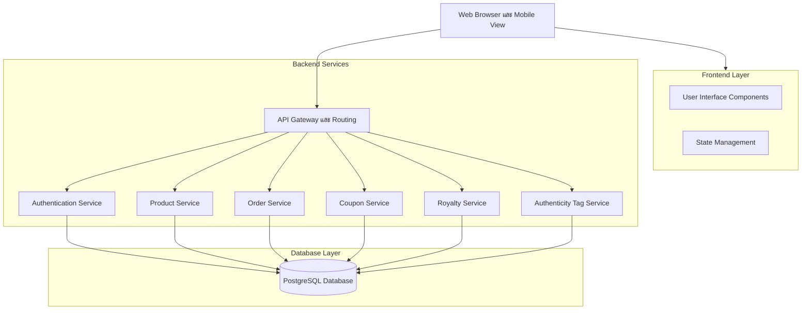
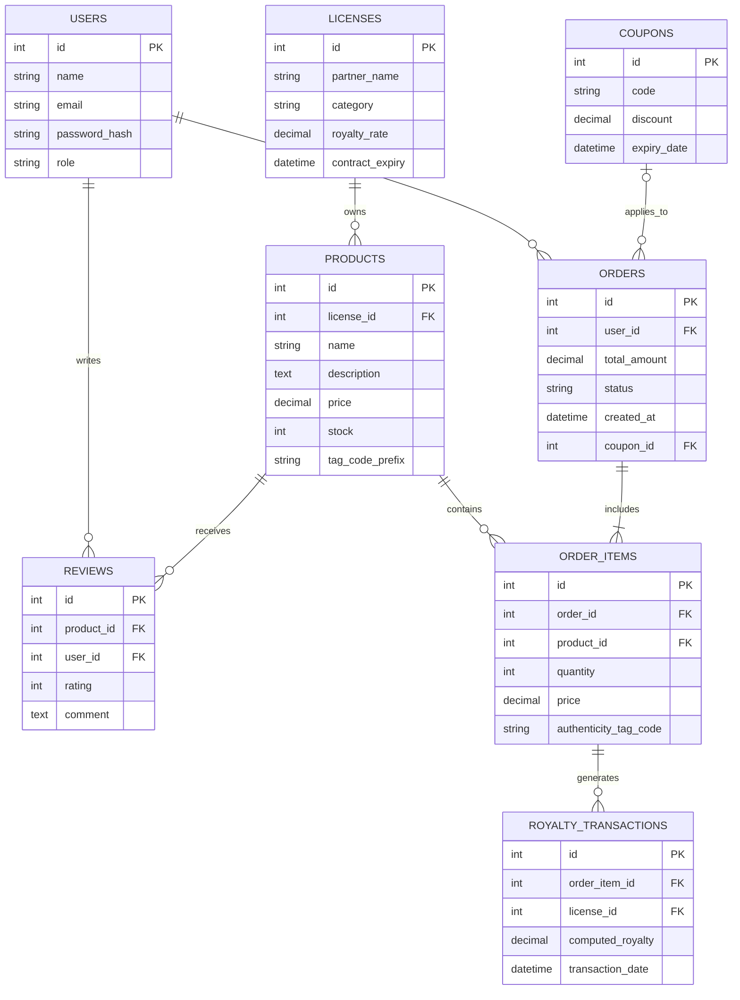
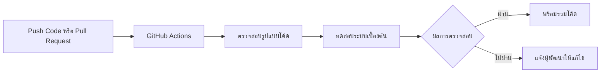

# AllThingMerch - Licensed Merchandise E-Commerce Platform

**System Analysis and Design Specification (SADS)**  
**เอกสารวิเคราะห์และออกแบบระบบ**

เอกสารฉบับนี้จัดทำขึ้นเพื่อใช้ประกอบโปรเจกต์ในรายวิชา DIGITAL PLATFORM FOR SOFTWARE DEVELOPMENT

---

## สารบัญ

1. ภาพรวมโครงการและวัตถุประสงค์
2. ขอบเขตและเป้าหมายทางธุรกิจ
3. ผู้ใช้งานระบบและบทบาท
4. ขอบเขตระบบ
5. ความต้องการเชิงฟังก์ชัน
6. ความต้องการเชิงคุณลักษณะ
7. สถาปัตยกรรมของระบบ
8. การออกแบบโครงสร้างข้อมูล
9. แนวทางการทำงานร่วมกัน
10. กระบวนการส่งมอบซอฟต์แวร์
11. แผนการดำเนินงาน
12. การจัดการความเสี่ยง
13. รายชื่อสมาชิกกลุ่ม

---

## 1. ภาพรวมโครงการและวัตถุประสงค์

### 1.1 ภาพรวมโครงการ

**LicenMerch** เป็นแพลตฟอร์มพาณิชย์อิเล็กทรอนิกส์สำหรับจำหน่ายสินค้าลิขสิทธิ์แท้ โดยเน้นสินค้าจากกลุ่มแฟนคลับและสินค้าสะสม เช่น ทีมแข่งรถ Formula 1 ศิลปินระดับโลก และสโมสรฟุตบอลชั้นนำ

ระบบถูกออกแบบให้ลูกค้าสามารถค้นหาสินค้า สั่งซื้อสินค้า สั่งซื้อล่วงหน้า ดูข้อมูลการรับประกันสินค้าแท้จาก TAG ที่ร้านออกให้ และติดตามคำสั่งซื้อได้ภายในแพลตฟอร์มเดียวกัน อีกทั้งยังมีระบบหลังบ้านสำหรับผู้ดูแลระบบในการจัดการสินค้า สต๊อกสินค้า คำสั่งซื้อ คูปองส่วนลด สัญญาลิขสิทธิ์ และรายงานส่วนแบ่งลิขสิทธิ์

### 1.2 ปัญหาที่ต้องการแก้ไข

1. ลูกค้าไม่มั่นใจว่าสินค้าที่ซื้อเป็นสินค้าลิขสิทธิ์แท้
2. การจัดการสินค้าลิขสิทธิ์จากหลายแบรนด์มีความซับซ้อน
3. การคำนวณส่วนแบ่งลิขสิทธิ์ให้ผู้ถือสิทธิ์ต้องมีความถูกต้องและตรวจสอบได้
4. สินค้ารุ่นพิเศษหรือสินค้าจำนวนจำกัดต้องรองรับการสั่งซื้อล่วงหน้าอย่างเป็นระบบ

### 1.3 วัตถุประสงค์ของระบบ

1. พัฒนาระบบร้านค้าออนไลน์สำหรับสินค้าลิขสิทธิ์แท้
2. รองรับการสั่งซื้อสินค้าและการสั่งซื้อล่วงหน้า
3. สร้างระบบออก TAG รับประกันสินค้าแท้ให้สินค้าทุกชิ้นที่ซื้อจากทางร้าน
4. สร้างระบบจัดการสัญญาลิขสิทธิ์และคำนวณส่วนแบ่งรายได้
---

## 2. ขอบเขตและเป้าหมายทางธุรกิจ

### 2.1 เป้าหมายทางธุรกิจ

1. เพิ่มความน่าเชื่อถือของแพลตฟอร์มด้วย TAG รับประกันสินค้าแท้สำหรับสินค้าทุกชิ้น
2. เพิ่มโอกาสในการขายสินค้าจากกลุ่มแฟนคลับและนักสะสม
3. อำนวยความสะดวกในการค้นหาและกรองสินค้าตามประเภทลิขสิทธิ์
4. จัดการข้อมูลสัญญาลิขสิทธิ์และอัตราส่วนแบ่งรายได้อย่างเป็นระบบ
5. รองรับการเปิดขายสินค้ารุ่นพิเศษและสินค้าจำนวนจำกัดด้วยระบบสั่งซื้อล่วงหน้า

### 2.2 กลุ่มสินค้าที่ระบบรองรับ

ระบบ LicenMerch รองรับการจัดจำหน่ายสินค้าลิขสิทธิ์แท้หลากหลายประเภท โดยเน้นสินค้าที่เกี่ยวข้องกับแบรนด์ บุคคล องค์กร ทีม ศิลปิน สื่อบันเทิง กีฬา และกลุ่มแฟนคลับต่าง ๆ ซึ่งสามารถเพิ่มเติมหรือปรับเปลี่ยนหมวดหมู่สินค้าได้ตามความเหมาะสมในอนาคต

ตัวอย่างกลุ่มสินค้าที่ระบบสามารถรองรับได้ มีดังนี้

1. สินค้าแฟชั่นและเครื่องแต่งกาย
2. สินค้าของสะสม
3. สินค้า Limited Edition
4. สินค้า Pre-order
5. สินค้าที่เกี่ยวข้องกับศิลปิน ทีมกีฬา แบรนด์ หรือคอนเทนต์ลิขสิทธิ์
6. สินค้าอื่น ๆ ที่ได้รับอนุญาตให้จัดจำหน่ายอย่างถูกต้องตามลิขสิทธิ์

การกำหนดกลุ่มสินค้าในลักษณะกว้างนี้ช่วยให้ระบบสามารถขยายประเภทสินค้าได้ในอนาคต โดยไม่จำเป็นต้องแก้ไขโครงสร้างหลักของระบบใหม่ทั้งหมด

---

## 3. ผู้ใช้งานระบบและบทบาท

### 3.1 ลูกค้า

ลูกค้าเป็นผู้ใช้งานหลักของระบบ มีหน้าที่ค้นหา เลือกซื้อ สั่งซื้อ ดูข้อมูล TAG รับประกันสินค้าแท้ และติดตามคำสั่งซื้อ

### 3.2 ผู้ดูแลระบบ

ผู้ดูแลระบบเป็นผู้จัดการข้อมูลหลักของแพลตฟอร์ม มีหน้าที่ดูแลสินค้า คำสั่งซื้อ คูปอง สัญญาลิขสิทธิ์ และรายงานส่วนแบ่งรายได้

### 3.3 ผู้ถือครองลิขสิทธิ์

ผู้ถือครองลิขสิทธิ์เป็นเจ้าของแบรนด์ ทีม ศิลปิน หรือสโมสรที่อนุญาตให้แพลตฟอร์มนำสินค้ามาจำหน่าย โดยระบบจะบันทึกอัตราส่วนแบ่งรายได้ตามสัญญา

---

## 4. ขอบเขตระบบ

### 4.1 ขอบเขตระบบสำหรับลูกค้า

1. สมัครสมาชิก
2. เข้าสู่ระบบ
3. ออกจากระบบ
4. แก้ไขข้อมูลส่วนตัว
5. ค้นหาสินค้า
6. กรองสินค้าตามประเภทลิขสิทธิ์
7. ดูรายละเอียดสินค้า
8. เพิ่มสินค้าลงตะกร้า
9. ปรับจำนวนสินค้าในตะกร้า
10. ลบสินค้าออกจากตะกร้า
11. สั่งซื้อสินค้า
12. ทำรายการสั่งซื้อล่วงหน้า
13. ใช้โค้ดส่วนลด
14. ดูข้อมูล TAG รับประกันสินค้าแท้ของสินค้าที่ซื้อจากทางร้าน
15. ติดตามสถานะคำสั่งซื้อ
16. ดูประวัติการสั่งซื้อ
17. รีวิวสินค้า
18. ให้คะแนนสินค้า

### 4.2 ขอบเขตระบบสำหรับผู้ดูแลระบบ

1. เพิ่มข้อมูลสินค้า
2. แก้ไขข้อมูลสินค้า
3. ลบข้อมูลสินค้า
4. จัดการจำนวนสต๊อกสินค้า
5. จัดการข้อมูลผู้ถือครองลิขสิทธิ์
6. จัดการข้อมูลสัญญาลิขสิทธิ์
7. กำหนดอัตราส่วนแบ่งลิขสิทธิ์
8. ตรวจสอบรายการคำสั่งซื้อ
9. ออก TAG รับประกันสินค้าแท้ให้กับสินค้าแต่ละรายการ
10. อัปเดตสถานะการจัดส่งสินค้า
11. สร้างคูปองส่วนลด
12. กำหนดวันหมดอายุของคูปองส่วนลด
13. ตรวจสอบรายงานยอดขาย
14. ตรวจสอบรายงานยอดเงินส่วนแบ่งลิขสิทธิ์

### 4.3 ขอบเขตที่ไม่รวมในระบบ

1. ระบบผลิตสินค้าในโรงงาน
2. ระบบขนส่งจริงของบริษัทขนส่งภายนอก
3. ระบบชำระเงินจริงผ่านธนาคาร
4. ระบบบัญชีเต็มรูปแบบขององค์กร
5. ระบบจัดการคลังสินค้าขนาดใหญ่หลายสาขา

---

## 5. ความต้องการเชิงฟังก์ชัน

### 5.1 ความต้องการเชิงฟังก์ชันสำหรับลูกค้า

| รหัส | ฟังก์ชัน | รายละเอียด | ความสำคัญ |
| :--- | :--- | :--- | :--- |
| C-01 | สมัครสมาชิก | ลูกค้าสามารถสร้างบัญชีผู้ใช้ด้วยชื่อ อีเมล และรหัสผ่าน | High |
| C-02 | เข้าสู่ระบบ | ลูกค้าสามารถเข้าสู่ระบบด้วยอีเมลและรหัสผ่าน | High |
| C-03 | ออกจากระบบ | ลูกค้าสามารถออกจากระบบเพื่อยุติการใช้งานบัญชี | Medium |
| C-04 | แก้ไขข้อมูลส่วนตัว | ลูกค้าสามารถแก้ไขชื่อ ที่อยู่ และข้อมูลติดต่อ | Medium |
| C-05 | ค้นหาสินค้า | ลูกค้าสามารถค้นหาสินค้าจากชื่อสินค้าและคำสำคัญ | High |
| C-06 | กรองสินค้า | ลูกค้าสามารถกรองสินค้าตามประเภทลิขสิทธิ์ แบรนด์ ราคา และสถานะสินค้า | High |
| C-07 | ดูรายละเอียดสินค้า | ลูกค้าสามารถดูรูปภาพสินค้า ราคา รายละเอียดสินค้า จำนวนคงเหลือ และข้อมูลลิขสิทธิ์ | High |
| C-08 | เพิ่มสินค้าลงตะกร้า | ลูกค้าสามารถเพิ่มสินค้าที่ต้องการลงในตะกร้า | High |
| C-09 | ปรับจำนวนสินค้าในตะกร้า | ลูกค้าสามารถเพิ่มหรือลดจำนวนสินค้าก่อนสั่งซื้อ | High |
| C-10 | ลบสินค้าออกจากตะกร้า | ลูกค้าสามารถลบสินค้าที่ไม่ต้องการออกจากตะกร้า | High |
| C-11 | สั่งซื้อสินค้า | ลูกค้าสามารถยืนยันคำสั่งซื้อสินค้าที่มีอยู่ในสต๊อก | High |
| C-12 | ทำรายการสั่งซื้อล่วงหน้า | ลูกค้าสามารถสั่งซื้อล่วงหน้าสำหรับสินค้ารุ่นพิเศษหรือสินค้าที่เปิดให้จอง | High |
| C-13 | ใช้โค้ดส่วนลด | ลูกค้าสามารถกรอกโค้ดส่วนลดเพื่อปรับราคาสุทธิของคำสั่งซื้อ | Medium |
| C-14 | ดูข้อมูล TAG รับประกันสินค้าแท้ | ลูกค้าสามารถดูรายละเอียด TAG รับประกันสินค้าแท้ที่ร้านออกให้กับสินค้าทุกชิ้นที่ซื้อจากทางร้าน | High |
| C-15 | ติดตามสถานะคำสั่งซื้อ | ลูกค้าสามารถดูสถานะคำสั่งซื้อ เช่น รอดำเนินการ กำลังจัดส่ง และจัดส่งสำเร็จ | High |
| C-16 | ดูประวัติการสั่งซื้อ | ลูกค้าสามารถดูรายการสินค้าที่เคยสั่งซื้อในอดีต | Medium |
| C-17 | รีวิวสินค้า | ลูกค้าสามารถเขียนความคิดเห็นเกี่ยวกับสินค้าที่เคยซื้อ | Medium |
| C-18 | ให้คะแนนสินค้า | ลูกค้าสามารถให้คะแนนสินค้าในระดับ 1 ถึง 5 คะแนน | Medium |

### 5.2 ความต้องการเชิงฟังก์ชันสำหรับผู้ดูแลระบบ

| รหัส | ฟังก์ชัน | รายละเอียด | ความสำคัญ |
| :--- | :--- | :--- | :--- |
| A-01 | เพิ่มสินค้า | ผู้ดูแลระบบสามารถเพิ่มข้อมูลสินค้าใหม่เข้าสู่ระบบ | High |
| A-02 | แก้ไขสินค้า | ผู้ดูแลระบบสามารถแก้ไขชื่อสินค้า ราคา รายละเอียดสินค้า และข้อมูลลิขสิทธิ์ | High |
| A-03 | ลบสินค้า | ผู้ดูแลระบบสามารถลบสินค้าที่ไม่ต้องการแสดงในระบบ | Medium |
| A-04 | จัดการสต๊อกสินค้า | ผู้ดูแลระบบสามารถเพิ่ม ลด และตรวจสอบจำนวนสินค้าคงเหลือ | High |
| A-05 | จัดการผู้ถือครองลิขสิทธิ์ | ผู้ดูแลระบบสามารถเพิ่มและแก้ไขข้อมูลเจ้าของลิขสิทธิ์ | High |
| A-06 | จัดการสัญญาลิขสิทธิ์ | ผู้ดูแลระบบสามารถบันทึกวันเริ่มต้น วันหมดอายุ และเงื่อนไขของสัญญา | High |
| A-07 | กำหนดอัตราส่วนแบ่งลิขสิทธิ์ | ผู้ดูแลระบบสามารถกำหนดเปอร์เซ็นต์ส่วนแบ่งรายได้ให้แต่ละเจ้าของลิขสิทธิ์ | High |
| A-08 | ตรวจสอบคำสั่งซื้อ | ผู้ดูแลระบบสามารถดูรายละเอียดคำสั่งซื้อทั้งหมด | High |
| A-09 | ออก TAG รับประกันสินค้าแท้ | ระบบสามารถออก TAG รับประกันสินค้าแท้เฉพาะรายการสินค้าเมื่อคำสั่งซื้อสำเร็จ | High |
| A-10 | อัปเดตสถานะจัดส่ง | ผู้ดูแลระบบสามารถเปลี่ยนสถานะคำสั่งซื้อให้ตรงกับขั้นตอนการจัดส่ง | High |
| A-11 | สร้างคูปองส่วนลด | ผู้ดูแลระบบสามารถสร้างโค้ดส่วนลดสำหรับกิจกรรมส่งเสริมการขาย | Medium |
| A-12 | กำหนดวันหมดอายุคูปอง | ผู้ดูแลระบบสามารถกำหนดระยะเวลาการใช้งานของคูปองส่วนลด | Medium |
| A-13 | ตรวจสอบรายงานยอดขาย | ผู้ดูแลระบบสามารถดูยอดขายตามช่วงเวลาและตามประเภทสินค้า | High |
| A-14 | ตรวจสอบรายงานส่วนแบ่งลิขสิทธิ์ | ผู้ดูแลระบบสามารถดูยอดเงินที่ต้องนำจ่ายให้ผู้ถือครองลิขสิทธิ์ | High |

---

## 6. ความต้องการเชิงคุณลักษณะ

| หมวดหมู่ | รายละเอียด |
| :--- | :--- |
| Performance | หน้าเว็บต้องโหลดได้รวดเร็ว และการค้นหาสินค้าควรตอบสนองภายในเวลาที่เหมาะสม |
| Security | รหัสผ่านต้องจัดเก็บในรูปแบบแฮช และการเข้าถึงระบบหลังบ้านต้องตรวจสอบสิทธิ์ผู้ใช้ |
| Authorization | ระบบต้องแยกสิทธิ์ระหว่างลูกค้าและผู้ดูแลระบบอย่างชัดเจน |
| Usability | หน้าจอใช้งานง่าย เหมาะกับสินค้าพรีเมียม สินค้าสะสม และกลุ่มแฟนคลับ |
| Responsive Design | ระบบต้องรองรับการแสดงผลบนคอมพิวเตอร์ แท็บเล็ต และโทรศัพท์มือถือ |
| Availability | ระบบควรรองรับผู้ใช้งานจำนวนมากในช่วงเปิดขายสินค้ารุ่นพิเศษ |
| Data Accuracy | การคำนวณราคาสินค้า ส่วนลด และส่วนแบ่งลิขสิทธิ์ต้องถูกต้อง |
| Maintainability | โค้ดต้องแบ่งส่วนชัดเจนเพื่อให้ง่ายต่อการพัฒนาและบำรุงรักษา |
| Auditability | ระบบต้องเก็บข้อมูลคำสั่งซื้อและธุรกรรมส่วนแบ่งลิขสิทธิ์เพื่อการตรวจสอบย้อนหลัง |

---

## 7. สถาปัตยกรรมของระบบ

ระบบใช้สถาปัตยกรรมแบบ Client Server โดยแบ่งการทำงานออกเป็น 3 ชั้นหลัก ได้แก่

1. Frontend Layer
2. Backend Layer
3. Database Layer

### 7.1 Frontend Layer

Frontend Layer ใช้สำหรับแสดงผลหน้าร้านออนไลน์และรับคำสั่งจากผู้ใช้ โดยใช้เทคโนโลยีดังนี้

1. Next.js
2. React
3. State Management ด้วย Redux หรือ Context

### 7.2 Backend Layer

Backend Layer ใช้สำหรับประมวลผลคำขอจาก Frontend และเชื่อมต่อฐานข้อมูล โดยใช้เทคโนโลยีดังนี้

1. Node.js
2. Express
3. REST API
4. JWT Authentication

### 7.3 Database Layer

Database Layer ใช้สำหรับจัดเก็บข้อมูลหลักของระบบ โดยใช้ PostgreSQL เป็นฐานข้อมูลเชิงสัมพันธ์

---

## 8. การออกแบบโครงสร้างข้อมูล

### 8.1 รายการ Entity หลัก

1. Users
2. Licenses
3. Products
4. Orders
5. Order Items
6. Royalty Transactions
7. Reviews
8. Coupons

### 8.2 Entity Relationship Diagram

### 8.3 รายละเอียดข้อมูลสำคัญ

#### 8.3.1 Users

1. เก็บข้อมูลบัญชีผู้ใช้งาน
2. แยกบทบาทผู้ใช้เป็นลูกค้าและผู้ดูแลระบบ
3. เก็บรหัสผ่านในรูปแบบแฮช

#### 8.3.2 Licenses

1. เก็บข้อมูลผู้ถือครองลิขสิทธิ์
2. เก็บประเภทลิขสิทธิ์ เช่น ทีม Formula 1 ศิลปิน และสโมสรฟุตบอล
3. เก็บอัตราส่วนแบ่งลิขสิทธิ์
4. เก็บวันหมดอายุของสัญญา

#### 8.3.3 Products

1. เก็บข้อมูลสินค้า
2. เชื่อมโยงสินค้ากับผู้ถือครองลิขสิทธิ์
3. เก็บราคาและจำนวนคงเหลือ
4. เก็บคำนำหน้ารหัส TAG รับประกันสินค้าแท้สำหรับสินค้าแต่ละกลุ่ม

#### 8.3.4 Orders

1. เก็บข้อมูลคำสั่งซื้อ
2. เชื่อมโยงคำสั่งซื้อกับลูกค้า
3. เก็บยอดรวมหลังคำนวณส่วนลด
4. เก็บสถานะคำสั่งซื้อ

#### 8.3.5 Royalty Transactions

1. เก็บข้อมูลธุรกรรมส่วนแบ่งลิขสิทธิ์
2. คำนวณจากราคาขายและอัตราส่วนแบ่งของผู้ถือครองลิขสิทธิ์
3. ใช้สำหรับจัดทำรายงานให้ผู้ดูแลระบบตรวจสอบ

---

## 9. แนวทางการทำงานร่วมกัน

ทีมใช้ Git และ GitHub ในการจัดการ Source Code โดยกำหนดแนวทางการทำงานดังนี้

### 9.1 Branching Strategy

1. `main`
   1. ใช้เก็บโค้ดที่เสถียรที่สุด
   2. ใช้สำหรับรัน Demo หรือส่งงาน
2. `develop`
   1. ใช้รวมฟีเจอร์ที่กำลังพัฒนา
   2. ใช้ทดสอบก่อนนำเข้า `main`
3. `feature-ชื่อฟีเจอร์`
   1. ใช้สำหรับพัฒนาฟีเจอร์แยกตามงาน
   2. ตัวอย่างเช่น `feature-licensing`
   3. ตัวอย่างเช่น `feature-authenticity-tag`

### 9.2 Commit Convention

1. `feat: add authenticity tag guarantee`
2. `fix: resolve royalty payout calculation`
3. `docs: update SADS document`
4. `refactor: improve order service`

### 9.3 Pull Request

1. สมาชิกทีมต้องสร้าง Pull Request เมื่อต้องการรวมโค้ดเข้าสู่ `develop`
2. สมาชิกในทีมต้องตรวจสอบโค้ดก่อน Merge
3. Pull Request ต้องผ่านการตรวจสอบรูปแบบโค้ดก่อนรวมเข้าสู่ Branch หลัก

---

## 10. กระบวนการส่งมอบซอฟต์แวร์

ใช้ GitHub Actions เพื่อช่วยตรวจสอบคุณภาพของโค้ดก่อนรวมงาน โดยแบ่งกระบวนการออกเป็นขั้นตอนดังนี้

1. Push Code หรือสร้าง Pull Request
2. GitHub Actions เริ่มทำงาน
3. ตรวจสอบรูปแบบโค้ด
4. ทดสอบระบบเบื้องต้น
5. แจ้งผลการตรวจสอบ
6. อนุมัติการรวมโค้ดเมื่อผ่านทุกขั้นตอน

### 10.1 Continuous Integration

1. ตรวจสอบ Syntax ของโค้ด
2. ตรวจสอบ Coding Style
3. รัน Unit Test เบื้องต้น
4. แจ้งผลลัพธ์ให้ทีมพัฒนา

### 10.2 Continuous Delivery

1. เตรียมโค้ดที่ผ่านการตรวจสอบสำหรับการ Demo
2. ลดความผิดพลาดก่อนส่งมอบงาน
3. ทำให้ทีมสามารถรวมงานได้อย่างเป็นระบบ

---

## 11. แผนการดำเนินงาน

| Phase | รายละเอียด | ผลลัพธ์ที่คาดหวัง |
| :--- | :--- | :--- |
| Phase 1 Design | ออกแบบหน้าจอหลัก ออกแบบโครงสร้างฐานข้อมูล และออกแบบ Flow การใช้งาน | ได้แบบร่างระบบและ ERD |
| Phase 2 Core Development | พัฒนาระบบบัญชีผู้ใช้ ระบบเข้าสู่ระบบ และระบบจัดการสินค้า | ได้ระบบพื้นฐานที่ใช้งานได้ |
| Phase 3 Shopping | พัฒนาตะกร้าสินค้า ระบบสั่งซื้อ และระบบสั่งซื้อล่วงหน้า | ลูกค้าสามารถทำรายการซื้อได้ |
| Phase 4 Authenticity Tag | พัฒนาระบบออกและแสดงข้อมูล TAG รับประกันสินค้าแท้ | ลูกค้าสามารถเห็นข้อมูล TAG รับประกันสินค้าแท้ของสินค้าที่ซื้อได้ |
| Phase 5 Royalties | พัฒนาระบบคำนวณส่วนแบ่งลิขสิทธิ์และรายงานหลังบ้าน | ผู้ดูแลระบบตรวจสอบยอดส่วนแบ่งได้ |
| Phase 6 Testing and Demo | ทดสอบระบบรวม แก้ไขข้อผิดพลาด และเตรียมนำเสนอ | ได้ระบบพร้อมนำเสนอในชั้นเรียน |

---

## 12. การจัดการความเสี่ยง

| ความเสี่ยง | ผลกระทบ | แผนการจัดการรองรับ |
| :--- | :---: | :--- |
| TAG รับประกันสินค้าแท้ถูกปลอมแปลง | สูง | กำหนดรหัส TAG ที่ไม่ซ้ำกัน บันทึกประวัติการออก TAG และจำกัดการออก TAG เฉพาะคำสั่งซื้อที่สำเร็จ |
| การคำนวณส่วนแบ่งลิขสิทธิ์คลาดเคลื่อน | สูง | จัดทำ Unit Test สำหรับสูตรคำนวณส่วนแบ่งและการปัดเศษ |
| ผู้ใช้งานจำนวนมากในช่วงเปิดขายสินค้ารุ่นพิเศษ | ปานกลางถึงสูง | ใช้แนวคิด Order Queueing และปรับปรุงประสิทธิภาพการเขียนข้อมูล |
| ข้อมูลสินค้าไม่ตรงกับข้อมูลลิขสิทธิ์ | ปานกลาง | บังคับให้สินค้าทุกชิ้นต้องเชื่อมโยงกับ License ID |
| ผู้ดูแลระบบเข้าถึงข้อมูลผิดพลาด | ปานกลาง | ใช้ Role Based Access Control และตรวจสอบสิทธิ์ก่อนเข้าถึงระบบหลังบ้าน |
| ทีมพัฒนา Merge โค้ดทับกัน | ปานกลาง | ใช้ Branching Strategy และ Pull Request Review |

---

## 13. รายชื่อสมาชิกกลุ่ม

| รหัสนักศึกษา | ชื่อและนามสกุล | หน้าที่ |
| :--- | :--- | :--- |
| 67160165 | นายธนกร หีบเงิน | ผู้พัฒนา Frontend/Backend |
| 67160449 | นายณฐมน โชติกุล | ผู้พัฒนา Frontend/Backend | 
| 67132694 | นายนิรินทร์ เทพวิสุทธิพันธุ์ | ผู้พัฒนา Frontend/Backend | 
| 67167855 | นายกฤตณัฐ อิ้วสมจิตร | ผู้ออกแบบฐานข้อมูลและระบบลิขสิทธิ์ |
| 67185699 | นางสาว กนกร ทะทอง | ผู้จัดทำเอกสารและทดสอบระบบ |

---

## ภาคผนวก ก คำสำคัญของระบบ

เพื่อให้เอกสารชัดเจนและไม่รวมหลายคำสั่งไว้ในบรรทัดเดียว จึงแยกคำสำคัญของระบบออกเป็นรายการดังนี้

1. สั่งซื้อสินค้า
2. ทำรายการสั่งซื้อล่วงหน้า
3. ใช้โค้ดส่วนลด
4. ดูข้อมูล TAG รับประกันสินค้าแท้
5. จัดการสินค้า
6. จัดการสต๊อกสินค้า
7. จัดการสัญญาลิขสิทธิ์
8. คำนวณส่วนแบ่งลิขสิทธิ์
9. ตรวจสอบรายงานยอดขาย
10. อัปเดตสถานะการจัดส่ง

---

© 2026 LicenMerch Development Team  
Document version 1.1 Revised SADS Draft