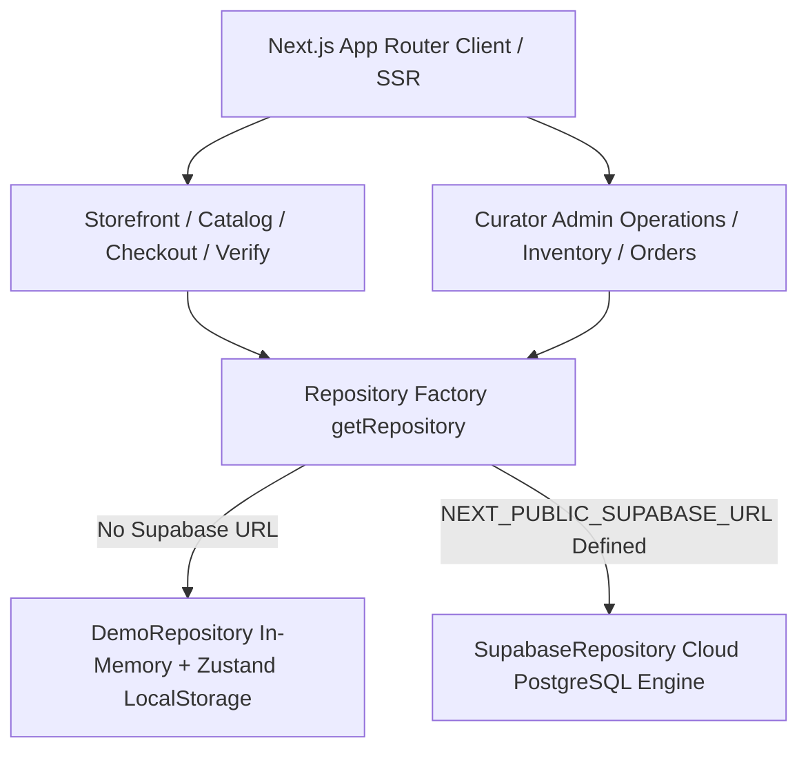
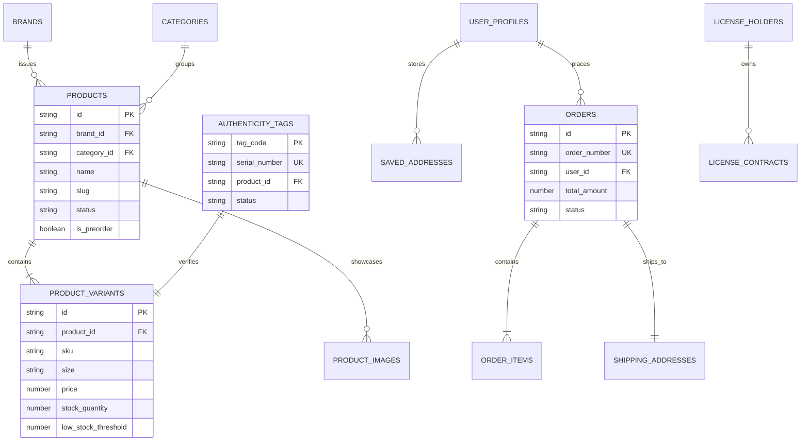

# AllThingsMerch System Architecture & Data Model

AllThingsMerch is built with a **Dual-Mode Architecture** designed to execute seamlessly in both standalone local environment (**Instant Demo Mode**) and live production cloud (**Supabase PostgreSQL Mode**).

## 1. High-Level Architecture Overview

## 2. Entity-Relationship (ER) Schema Diagram

## 3. Core Architectural Principles

1. **Monochrome Editorial Visual System**: Pure high-contrast white and black aesthetic inspired by architectural editorial layouts.
2. **Deterministic & Non-Blocking Demo Execution**: All operations (auth, cart, checkout, admin inventory management, tag verification) execute instantly offline without mandatory external dependencies.
3. **Strict Row Level Security (RLS)**: When connected to Supabase, all database tables enforce fine-grained authentication and authorization policies.
